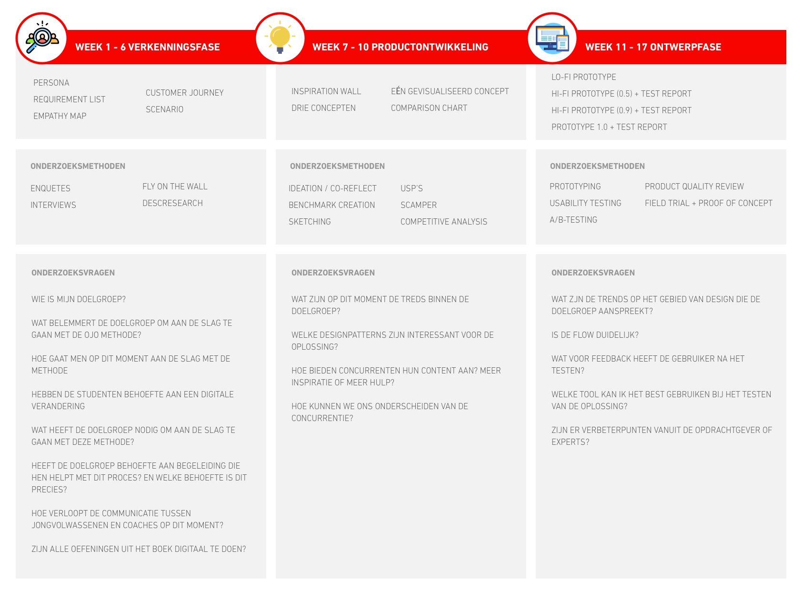

# 1.2 Planning

Om een overzicht te maken van wat er in de aankomende periode zal gebeuren, heb ik een plan van aanpak opgesteld. In dit plan van aanpak kun je terug vinden hoe mijn onderzoek zal verlopen en welke onderzoeksmethodes ik hiervoor ga gebruiken. Zo zal ik beginnen met de verkenningsfase en zal ik in een periode van 7 weken proberen toe te werken naar een eerste concept. Daarna zal ik dit concept met behulp van tests en verschillende iteraties uitwerken naar mijn prototype 1.0.

