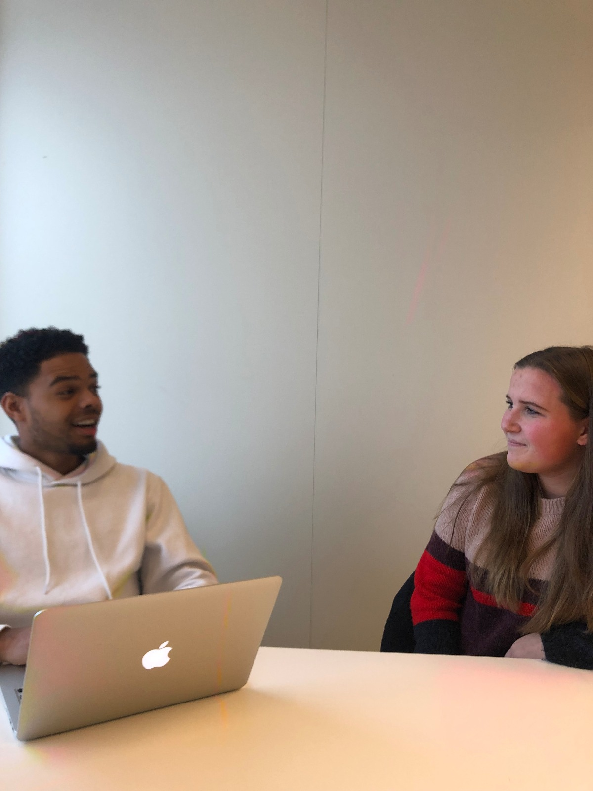
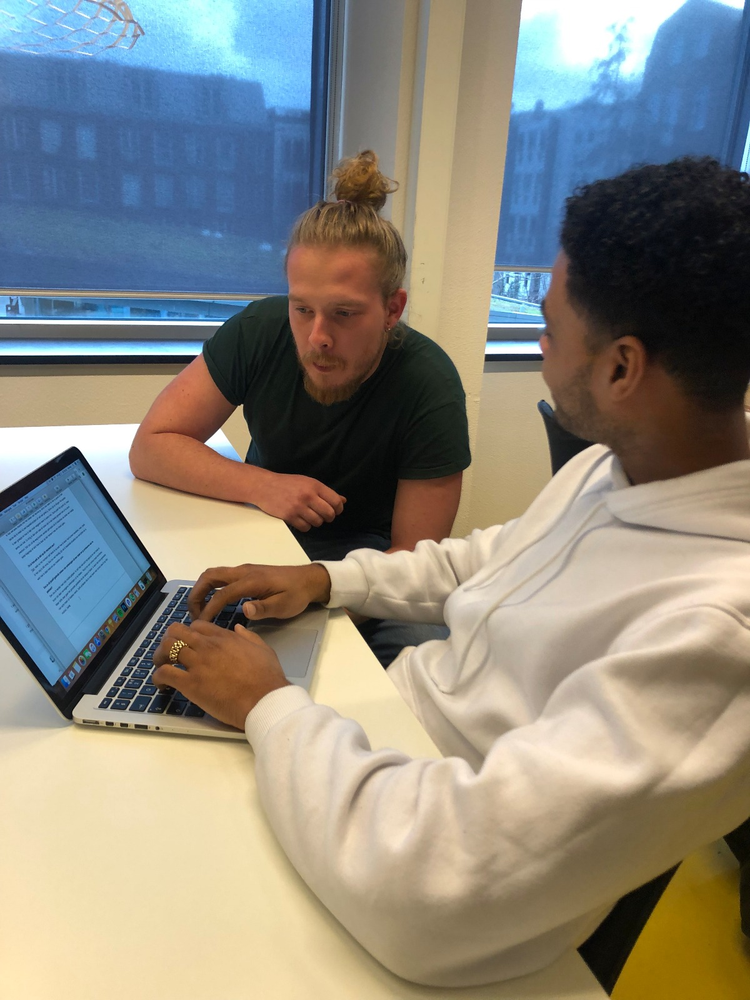
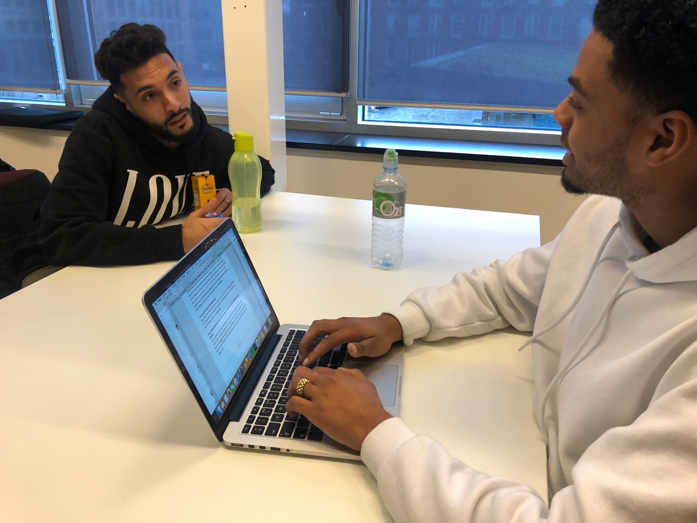
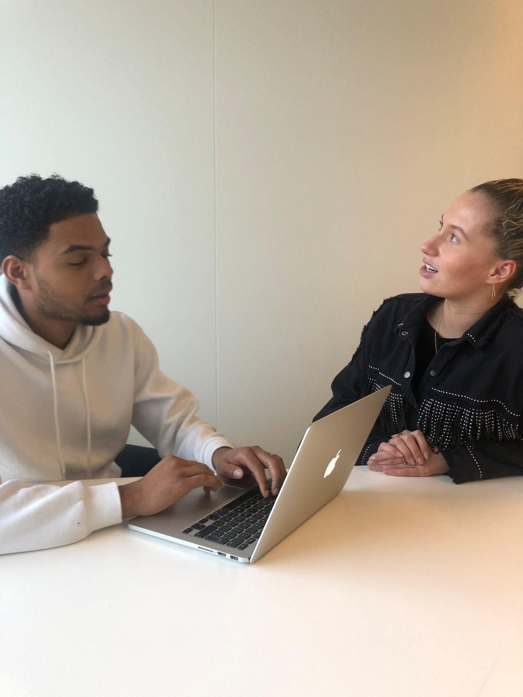

# 2.4 Interviews

## Inleiding

De volgende stap in mijn onderzoek was het interviewen van mijn doelgroep. Ik heb 5 interviews afgenomen binnen mijn doelgroep. Het doel van de interviews was om beter inzicht te krijgen in mijn toekomstige gebruiker en er achter te komen hoe zij denken over de huidige situatie van het probleem. Daarnaast heb ik ook onderzocht of zij open zouden staan voor verandering. De volledige uitwerking van de interviews is terug te vinden op deze pagina. Daarnaast zal ik de belangrijkste eisen voor mijn Programma van Eisen ook onderaan de pagina vermelden. 

**Let op! De 5 interviews zijn onderstaand verdeeld over meerdere tabbladen!** 

## Uitwerking interviews



## **Berat Zekaj**

_Woensdag 6 november  
2e jaars student Communication & Multimedia Design_

**Kan je iets over jezelf vertellen?**

Ik ben Berat Zekaj, ik ben 24 jaar en ik zit in mijn 2e leerjaar van CMD. In houd van mode en in mijn vrije tijd vind ik het leuk om te gamen. Daarnaast heb ik nog een bijbaantje in een restaurant. Thats it denk ik haha..

**Ben je bekend met Ontwerp je ontwikkeling?**  
Ik heb er over gehoord en weet nu enigszins wel wat het is. Als ik het goed begrijp is het een methode die kan helpen om mij keuzes te laten maken waar ik mee in de knoop zit.

**Uitleg over OJO**

**Heb je wel eens moeite met het maken van keuzes op het gebied van school of werk? Of anders? En waar komt dit door?**  
Ik heb wel eens moeite met het maken van keuzes ja, soms dan weet ik niet zo goed of een keuze die ik maak bij een bepaald project of vak wel goed is. Soms zijn er dingen die spelen in een groepje en hoe ik dan moet reageren weet ik soms niet.. Soms pakt het goed uit, maar soms ook niet. Zo krijg ik dan ook vaak te horen dat ik een beetje gemeen ben of te sterk overkom. Dat zou uit de weg kunnen worden geholpen als ik misschien de ander een beetje beter begreep of wist hoe ik daar op dat moment mee om moest gaan.

**Zo ja hoe pak je dat op dit moment aan?**  
Tjah, vaak na het moment zelf denk ik na over hoe ik beter had kunnen handelen, maar zoals ik het zeg is dat erna, dus zou wel handig zijn als ik bepaalde situaties kon vermijden als ik wist hoe ik daar mee om zou moeten gaan.

**Zou je uit jezelf gebruik maken van oefeningen uit een boek om je problemen aan te pakken?**

Dan zou ik eerder naar mijn mobiel grijpen. Ik zelf heb niet echt het geduld om een boek te lezen om daar vervolgens oefeningen uit te maken.. Tenzij het voor school moet tenminste. Maar zelfs daar gaat het grootste gedeelte via de laptop of tablet. Ik denk dat onze generatie niet echt meer uit boeken werkt. Zelfs artikelen die ik moet lezen voor school doe ik op mijn mobiel.. haha

**Zou je open staan voor begeleiding bij het maken van bepaalde keuzes?**  
Ja eigenlijk wel, maar die heb ik eigenlijk wel al een beetje met mijn SLC lessen.

**Op wat voor manier zou je begeleid willen worden? En door wie?**  
Niet te intensief denk ik. Ik zou het vervelend vinden om elke week een gesprek te moeten hebben over hoe het er nu aan toe gaat. Ik denk dat 1 keer in de paar weken genoeg zou zijn. En dit wel met iemand die ik kan vertrouwen, want volgens mij kan het soms over best persoonlijke dingen gaan.

**Op welke manier communiceer je op dit moment met je SLC docent?**

Uhm meestal via de mail, maar vaak reageren ze best laat of soms zelfs helemaal niet. Dus als ik echt een belangrijke vraag heb stap ik gewoon naar hem toe.

**Wat vindt jij de beste manier om te communiceren met een docent?**

Ik denk dat mailen het professioneelst is, maar je kan bijvoorbeeld niet zien op de docent je bericht heeft gelezen dus dat kan er wel voor zorgen dat je in onzekerheid blijft. Misschien is chatten wel een optie, maar ik denk niet dat leraren blij zijn als ze bijvoorbeeld whats app berichten krijgen van elke student.

**Uitleg over de Interactieve versie van OJO**

**Werk je liever digitaal of uit een boek? Waarom?**  
Ik denk dat ik dit al heb beantwoord in de vorige vragen.. 

**Wat zou je vinden van een digitale versie?**

Veel prettiger dan een boek denk ik. Naar mijn mening zal dit veel makkelijker werken en mij en andere studenten veel eerder motiveren om er gebruik van te maken. Het is natuurlijk ook veel makkelijker om je mobiel ergens mee naar toe te nemen dan een boek. Nu zou je ook onderweg naar school of iets dergelijks aan de opdrachten kunnen werken.

**Zou je hier ook uit jezelf gebruik van maken?**  
Ja sowieso. Vind dat er nu al veel te weinig begeleiding is op school, laat staan buiten school. Moet je nagaan dat ik gedurende 80% van me week in een les lokaal zit om vervolgens maar 20 minuten in 3 maanden ff te babbelen met een docent over hoe het nou “echt” gaat met mij.

**Maar ligt dit niet meer aan de begeleiding op school?**

Ja inderdaad. Misschien moeten die wat vaker plaatsvinden. En misschien zouden ze deze methode in die lessen toe moeten passen en bijvoorbeeld om de 2 of 3 weken een individuele terugkom dag waar de opdrachten besproken worden. Ik denk dat studenten zich dan nog beter ontwikkelen dan zij dat nu doen. 

**Wat denk je nodig te hebben als je aan de slag gaat met deze methode?**  
Een coach, dit zou mijn SLC’er kunnen zijn, want ik zou de opdrachten wel met iemand willen bespreken. Een goede online ontwikkeling, een vertaalslag van het boek naar jongerentaal, een simpele interface en niet te veel foefjes. Lekker hatsiekadee boem pats bij dat wat ik zoek uitkomen.



## **Esmee**

_Woensdag 6 november   
2e jaars student ICT_

**Kan je iets over jezelf vertellen?**

Nou mijn naam is Esmee. Ik ben 21 jaar oud en ik  studeer CMD aan de Hogeschool van Amsterdam. Ik werk als teamleider bij de Albert Heijn en in discotheek in de garderobe. Mijn hobby’s zijn zwemmen en als ik vrij ben lekker niks doen.

**Ben je bekend met Ontwerp je ontwikkeling?**  
Nee nooit van gehoord eigenlijk.

**Uitleg over OJO**

**Heb je wel eens moeite met het maken van keuzes op het gebied van school of werk? Of anders? En waar komt dit door?**

Ja best vaak. Meestal heb ik dit wel op het werk \(bij Albert Heijn\). Omdat ik als teamleider werk heb ik een leidinggevende functie. Dan vind ik het soms toch lastig om sommige keuzes te maken omdat ik het gevoel heb dat de keuzes die ik maak toch wel een bepaalde verantwoordelijkheid met zich mee brengen, misschien is het ook wel een beetje onzekerheid en dat ik bang ben dat ik de verkeerde keuze maak. Vooral omdat in mijn geval anderen er soms de dupe van kunnen zijn. Bij m’n andere werk is dat eigenlijk al een stuk minder. Daar heb ik minder verantwoordelijkheid.

**Zo ja hoe pak je dat op dit moment aan?**  
Ik probeer toch wel wat langer over sommige dingen na te denken. En daarbij probeer ik verder te kijken en er over na denken wat de gevolgen van mijn keuzes kunnen zijn.  
  
 **Heb je hier een voorbeeld van?**  
Bijvoorbeeld toen ik keuzevakken moest kiezen. Ik heb toen wel echt bewust nagedacht waar ik later verder in wil gaan en welke vakken daarvoor nuttig kunnen zijn. Als ik er echt niet uit kom vraag ik mijn ouders om mee te denken. Zij geven altijd wel goed advies.

**Zou je uit jezelf gebruik maken van oefeningen uit een boek om je problemen aan te pakken?**

Met problemen bedoel je een keuze maken toch?

**Ja, en misschien een uitdaging die je hebt, bijvoorbeeld dat je werkt aan die onzekerheid waar je het net over had.** 

Ja ik denk dat ik dat dan wel zou doen. 

**Zou je open staan voor begeleiding bij het maken van bepaalde keuzes?**  
Ja ik denk het wel, ik denk dat het nooit kwaad kan om hulp te krijgen bij het maken van keuzes. Wel vind ik dat het zo moet zijn dat degene die me begeleidt niet te veel invloed moet hebben op de keuze die ik maak. Diegene kan mij advies geven, maar ik moet toch echt zelf bepalen wat ik daadwerkelijk doe. 

**Op wat voor manier zou je begeleid willen worden? En door wie?**  
Hmm moeilijk. Ik denk dat wanneer ik met iets op het werk zit ik gauw op mijn manager af zou stappen. Op school zou ik dan op mijn mentor afstappen. Eigenlijk een beetje zoals hoe ik dat nu met mijn ouders doe, maar dan met iemand die iets meer verstand heeft van het probleem waar ik mee zit. Ik weet eerlijk gezegd niet waarom ik nu dat nog niet doe.  

**Op welke manier communiceer je op dit moment met je SLC docent of manager?**

Met mijn SLC docent is het eigenlijk alleen via de email en pas persoonlijk als ik een gesprek met hem heb. En met mijn manager via een groepsapp, via de mail en op de werkvloer.

**Wat vind jij de beste manier om te communiceren met een docent?**

Ik denk dat het wel handig is als je een snelle reactie krijgt, vooral als je met een probleem zit. En ik heb toch gemerkt dat het via de mail vaak wat langer kan duren voordat je antwoord hebt. Bij sommige leraren dan. Dan zou WhatsApp wel beter zijn. Hier kan je natuurlijk ook zien of het gelezen is of niet. Tenminste als diegene het aan heeft staan, maar volgens mij is dat bij veel mensen wel zo.

**Uitleg over de Interactieve versie van OJO**

**Werk je liever digitaal of uit een boek? Waarom?**  
Ik denk toch digitaal. Dat is gewoon makkelijker. Dan hoef je dat boek niet overal mee naar toe te nemen. En mijn telefoon of laptop heb ik bijna altijd wel bij me. In ieder geval me telefoon heb ik altijd bij me haha. 

**Wat zou je vinden van een digitale versie van OJO?**

Veel beter, vooral om wat ik net al zei. Mijn telefoon heb ik bijna altijd wel bij me dus dan zou ik er altijd wel gebruik van kunnen maken en bijvoorbeeld als ik in de trein zit zou ik er aan kunnen werken.

**Zou je hier ook uit jezelf gebruik van maken?**  
Hmm dat weet ik nog niet zo goed. Ik denk dat ik er eerst wat meer over zou moeten weten. Ik denk dat als iemand mij het zou aanbevelen ik er eerder gebruik van zou maken dan volledig uit mezelf.

**Wat denk je nodig te hebben als je aan de slag gaat met deze methode?**  
Op dit moment denk ik alleen wat meer informatie zodat ik zou kunnen beginnen. En misschien iemand die mijn dan begeleidt als ik aan de opdrachten werk. Misschien heb ik een vraag terwijl ik met een opdracht bezig ben, die zou ik dan wel aan iemand willen stellen. Ik denk dat dat in dit geval dan mijn manager op het werk kan zijn of mijn mentor op school. Alleen denk ik niet dat mijn manager op het werk verstand heeft van de methode. Dus ik denk eerder mijn mentor.



## Berry 

_Woensdag 6 november  
2e jaars student Communication & Multimedia Design_

**Kan je iets over jezelf vertellen?**

Hoi ik ben Berry. Ik ben 23 jaar oud en ik studeer Communication & Multimedia Design aan de Hogeschool van Amsterdam. Ik kom zelf uit Zaandam en heb hiervoor Marketing gedaan op het MBO. Ik houd van gamen en van gezelligheid met vriendinnen.

**Ben je bekend met Ontwerp je ontwikkeling?**  
Nee..?

**Uitleg over OJO**

**Heb je wel eens moeite met het maken van keuzes op het gebied van school of werk? Of anders? En waar komt dit door?**

Niet echt eigenlijk. Of naja het enige moment waar ik echt even over een keuze na moest denken was toen ik een keuze moest maken welke vakken ik wilde kiezen. En toen ik een minor moest kiezen. Maar toen was het meer onderzoek doen naar wat welke vakken inhouden en welke ik wel en niet leuk vond om te gaan doen. En bij die minor was het kiezen tussen een minor die weinig tijd kostte of eentje waar ik daadwerkelijk iets van zou leren.

**Dus je hebt onderzoek gedaan, waarom heb je iemand niet om hulp gevraagd bijvoorbeeld?**

Omdat het belangrijk voor mezelf is en niet voor een ander. Dus uiteindelijk moet ik deze keuze toch echt zelf maken.

**Zou je uit jezelf gebruik maken van oefeningen uit een boek om je problemen aan te pakken?**

Ligt er aan wat voor problemen het zijn.

**Ja meer over je eigen ontwikkeling. Bijvoorbeeld als je onzeker bent of als je onenigheid hebt binnen je projectgroepje.**

Hmm op zich wel.. Als ik in het boek zou kunnen lezen over hoe ik bepaalde dingen aan moet pakken zou ik dit wel interessant kunnen vinden. Maar ik denk dat ik nog niet genoeg weet over het boek om dat echt te kunnen beoordelen. En daarnaast moet ik mij ook wel kunnen vinden in de toon van het boek. 

**Zou je open staan voor begeleiding bij het maken van bepaalde keuzes?**  
Ja misschien wel, maar ik denk wel dat het er aan ligt wat voor keuzes dit zijn en door wie deze begeleiding zou zijn. Want ik zou bijvoorbeeld niet met een leraar willen praten over echte privé keuzes terwijl ik dit wel weer met mijn ouders zou bespreken. Dus het moet wel echt loopbaan gerelateerd zijn.

**Op wat voor manier zou je begeleid willen worden? En door wie?**  
Ik denk één keer in de zoveel tijd een gesprek ofzo. En door wie, net als wat ik hiervoor al zei dat het er aan moet liggen wat mijn probleem op dat moment is. Maar op school zou dit dat mijn SLC docent zijn of de decaan. En als het iets privé is mijn ouders of een vriendin dan.

**Op welke manier communiceer je op dit moment met je SLC docent of ouders?**

SLC docent via de mail en met mijn ouders via WhatsApp of ik bel ze gewoon op. Dat ligt er aan hoe belangrijk het is. We hebben ook een groepsapp met het gezin. 

**Wat vindt jij de beste manier om te communiceren met een docent?**

E-mail vind ik wel prettig. Ik denk dat WhatsApp toch iets te persoonlijk wordt. Het nadeel van mailen is wel dat docenten vaak laat reageren dus als je echt een belangrijke vraag hebt dat het wel vervelend kan zijn als je moet wachten. Ik ken wel klasgenoten die soms docenten appen maar ik zou dat niet zo snel doen. 

**Uitleg over de Interactieve versie van OJO**

**Werk je liever digitaal of uit een boek? Waarom?**  
Sowieso digitaal, ik vind boeken een beetje ouderwets. Als ik een boek lees doe ik dat zelfs digitaal. Het is gewoon veel makkelijker. Ook om mee te nemen.

**Wat zou je vinden van een digitale versie?**

Veel beter. Net als wat ik hiervoor al zei, je kan het makkelijk meenemen. Je kan dus je voortgang makkelijk bijhouden, je oefeningen onderweg maken en waarschijnlijk vergeet je het dan ook minder snel. Je zou misschien zelfs meldingen kunnen krijgen zodat je oefeningen op tijd maakt. 

**Zou je hier ook uit jezelf gebruik van maken?**  
Dat weet ik niet zo goed. Ik weet eigenlijk nog niet echt wat ik er uit kan halen. Ik zou er dan nog wat meer informatie over moeten hebben.

**Wat denk je nodig te hebben als je aan de slag gaat met deze methode?**

Toch wel wat meer informatie zoals ik net al zei. En iemand die mijn gemaakte opdrachten kan maken of beoordelen. En dat moet toch iemand zijn die verstand heeft van de opdrachten. Want ik denk dat mijn ouders niet goed zullen weten of iets goed is of niet.



## Taufieq

_Woensdag 6 november  
2e jaars student Communication & Multimedia Design_

**Kan je iets over jezelf vertellen?**

Nou, mijn naam is Taufiq. Ik ben 22 jaar oud en ik studeer Communication & Multimedia Design aan de Hogeschool van Amsterdam. Ik woon sinds kort hier in het centrum samen met mijn vriendin. Ik werk bij de Harbour Club als cocktailshaker.  

**Ben je bekend met Ontwerp je ontwikkeling?**  
Nee, sorry. 

**Uitleg over OJO**

**Heb je wel eens moeite met het maken van keuzes op het gebied van school of werk? Of anders? En waar komt dit door?**

Hmm.. Goeie vraag. Ik sta er eigenlijk nooit echt bij stil maar ik denk dat iedereen onbewust soms moeite heeft met het maken van keuzes. Zelf denk ik dat ik dit vaker heb op het gebied van school dan op mijn werk. School vraagt jou ook veel vaker om bepaalde keuzes te maken. 

**Wat voor soort keuzes bedoel je daarmee?**

Bijvoorbeeld het kiezen van vakken. Of welke richting je op wil. Ik wist echt heel lang niet of ik nou de Visual-kant op wilde gaan of dat ik mezelf wilde gaan verdiepen in Front-End. En dan moet je ook nog je eigen stage kiezen en een minor….  

**Zou je uit jezelf gebruik maken van oefeningen uit een boek om je problemen aan te pakken?**

Dat zou ik eerlijk gezegd zo snel even niet weten. Als er misschien meer wordt uitgelegd in het boek over wat de keuzes exact inhouden misschien wel. Of wat is de bedoeling van dat boek dan precies? 

**Het boek richt zich voornamelijk op je eigen ontwikkeling en hoe jij het best om kan gaan met bepaalde problemen en/of situaties.** 

Oh, dat vind ik altijd wel interessant. Ik vind het altijd leuk om te onderzoeken waarom wij - de mens - reageren en handelen zoals wij doen. M’n vriendin noemt dat mijn ‘zweefkant’. Is het boek ook zo zweverig? 

**Uitleg over de Interactieve versie van OJO**  

**Zou je open staan voor begeleiding bij het maken van bepaalde keuzes?**  
Jawel, ik houd ervan om tips te krijgen en ik denk dat tips van anderen nooit slecht voor jezelf kunnen zijn.  

**Op wat voor manier zou je begeleid willen worden? En door wie?**  
Hmm.. Op school? Denk dat het dan het beste is om door mijn SLC’er begeleid te worden. Dat gebeurt nu al maar eerlijk gezegd kan ik me de laatste keer niet eens herinneren dat ik een gesprek met haar had. Op werk ofzo heb ik ook wel eens functioneringsgesprekken maar dat vind ik ook wel prima.

**Op welke manier communiceer je op dit moment met je SLC docent of ouders?**

Met mijn SLC docent vrijwel niet, haha. Nee grapje. Als we contact hebben gaat dat gewoon via de mail. Met mijn ouders via de telefoon. 

**Wat vindt jij de beste manier om te communiceren met een docent?**

E-mail vind ik prima. Wat me wel zwaar irriteert is dat sommige leraren wel erg laat, en soms gewoon NIET reageren. Maar wij moeten het niet in ons hoofd halen om iets niet in te leveren of ergens niet op te antwoorden… 

**Werk je liever digitaal of uit een boek? Waarom?**  
Uit een boek. Haha nee grapje. De opleiding waarop we zitten maakt niet eens gebruik van boeken, dus sowieso digitaal. Toch vind ik het soms nog wel lekker om een boek te lezen in mijn vrije tijd, maar met werkbladen enzo vind ik digitaal wel beter. Ik heb ook niet zo een mooi handschrift.

**Wat zou je vinden van een digitale versie van OJO?**

Ik denk dat de kans veel groter is dat leerlingen dan gebruik zouden gaan maken van die methode. Denk dat momenteel niet heel veel mensen van het bestaan van dat boek afweten. 

**Zou je hier ook uit jezelf gebruik van maken?**  
Ik houd wel van nieuwe dingen uit proberen, dus als ik er meer info over zou krijgen van bijvoorbeeld mijn SLC’er \(long time no see, haha\) zou ik het wel een keer willen uitproberen. Misschien staan er echte master tips in. 

**Wat denk je nodig te hebben als je aan de slag gaat met deze methode?**

Sowieso een beetje meer uitleg en begeleiding. Denk niet dat dit een methode is die je geheel zelfstandig moet uitvoeren.



## Kendra Kroon

_Woensdag 6 november  
4e jaars student Communication & Multimedia Design_

**Kan je iets over jezelf vertellen?**

Ik ben Kendra Kroon, 21 jaar oud en woon in Amsterdam. Ik doe CMD en ben momenteel bezig met mijn Afstudeerproject, net als jij haha. In mijn vrij tijd heb ik een bijbaan en dans ik. 

**Ben je bekend met Ontwerp je ontwikkeling?**  
 Ik heb wel wat meegekregen van het boek, de schrijfster van het boek - Marianne Meijer-Meijers - is mijn SLC-coach.  

**Uitleg over OJO**

**Heb je wel eens moeite met het maken van keuzes op het gebied van school of werk? Of anders? En waar komt dit door?**

Onbewust wel eigenlijk. Ik denk vooral op school met al die keuzevakken, richtingen etc. Je moet onbewust op zo’n opleiding toch een hoop keuzes maken. Hoe ik dat 4 jaar lang gedaan heb weet ik eigenlijk niet, maar weet wel dat ik een lange tijd aan het twijfelen was over welke richting ik op wilde gaan. Ook heb ik stage gelopen op Curacao, hiervoor moest ik ook een hoop keuzes maken.

**Hoe heb je deze keuzes aangepakt?**  
 Ik praat altijd veel met mijn moeder als ik belangrijke dingen moet beslissen. Eigenlijk volg ik altijd haar advies op, ben het altijd wel met haar eens. Heb ook wel aan het einde van het eerste jaar getwijfeld over de opleiding, toen heb ik wel een goed gesprek gehad met mijn SLC’er. Zij heeft mij er toen van overtuigd dat CMD de juiste opleiding is voor mij, en daar heeft ze gelukkig zeker gelijk in gehad.  

**Zou je uit jezelf gebruik maken van oefeningen uit een boek om je problemen aan te pakken?**

Nou, aangezien Marianne mij wel eens eerder goed geholpen heeft, geloof ik wel dat haar boek nuttig voor mij zou kunnen zijn. Als het boek niet van haar was geweest, weet ik niet of ik het zomaar zou ‘geloven’. 

**Zou je open staan voor begeleiding bij het maken van bepaalde keuzes?**  
 Ja zeker. Op school tenminste. Ik zou geen levenscoach willen hebben die voor mij gaat bepalen wat ik vanavond moet eten bijvoorbeeld, haha. Maar op school vind ik advies van anderen vaak wel nuttig. Sowieso heb ik op de opleiding echt geleerd hoe je feedback van anderen moet aannemen en waarderen, dus hier moet ik bijna wel ja op antwoorden. 

**Op wat voor manier zou je begeleid willen worden? En door wie?**  
 Ik ben wel blij met mijn SLC coach. Ik zou dan wel door haar ook begeleidt willen worden.  

**Op welke manier communiceer je op dit moment met je SLC docent of manager?**

Via de mail en omdat zij nu ook mijn Afstudeerbegeleider is zitten we ook in een groep op Slack. Dat vind ik op zich wel fijn want het gaat een stuk sneller dan de mail. Met mijn manager op werk app ik gewoon. 

**Wat vind jij de beste manier om te communiceren met een docent?**

De mail is prima. Maar moet wel toegeven dat het onder de leerlingen algemeen bekend is dat er een hoop leraren zijn die de mailtjes vaak ‘over het hoofd zien’. Je kan ze ook appen, ik weet dat bijvoorbeeld Justus een docent is die via de app te bereiken is. Ik zou dat alleen zelf niet zo snel doen. Gewoon lekker via de mail houden, maar WEL soms wat sneller reageren leraren!! 

**Uitleg over de Interactieve versie van OJO**

**Werk je liever digitaal of uit een boek? Waarom?**  
 Digitaal!! Heb tegenwoordig niet eens meer pennen bij me als ik op school ben. Helemaal bij de opleiding die wij doen. Digitaal is het gewoon.  

**Wat zou je vinden van een digitale versie van OJO?**

Ja top. Zou denk ik voor een hoop leerlingen de drempel verlagen om gebruik te maken van de methode. Digitale versie is nou eenmaal gelijk een stukje ‘hipper’ dan een boek.  

**Zou je hier ook uit jezelf gebruik van maken?**  
 Ja! Zoals ik al eerder zei geloof ik wel in de denkwijze van de schrijfster. En als er een digitale versie van komt is het hopelijk super makkelijk te gebruiken, dus ja. Ik zou het wel een keertje willen proberen. 

**Wat denk je nodig te hebben als je aan de slag gaat met deze methode?**  
 Een telefoon, wat begeleiding van Marianne en misschien een concreet plan? Of komt dat naar voren in de app? Naja, het lijkt mij in ieder geval wel een leuk idee.



## Belangrijkste eisen

* De gebruiker moet kunnen chatten met zijn begeleider. **\(Must have\)**
* De gebruiker moet een snelle reactie kunnen ontvangen van begeleider. **\(Must have\)**
* De gebruiker moet onderweg kunnen werken aan de opdrachten. **\(Must have\)**
* De gebruiker wilt meldingen kunnen ontvangen. **\(Must have\)**
* De gebruiker wilt meer informatie kunnen vinden over OJO. **\(Must have\)**
* De student moet zijn voortgang bij kunnen houden**\(Should have\)**

