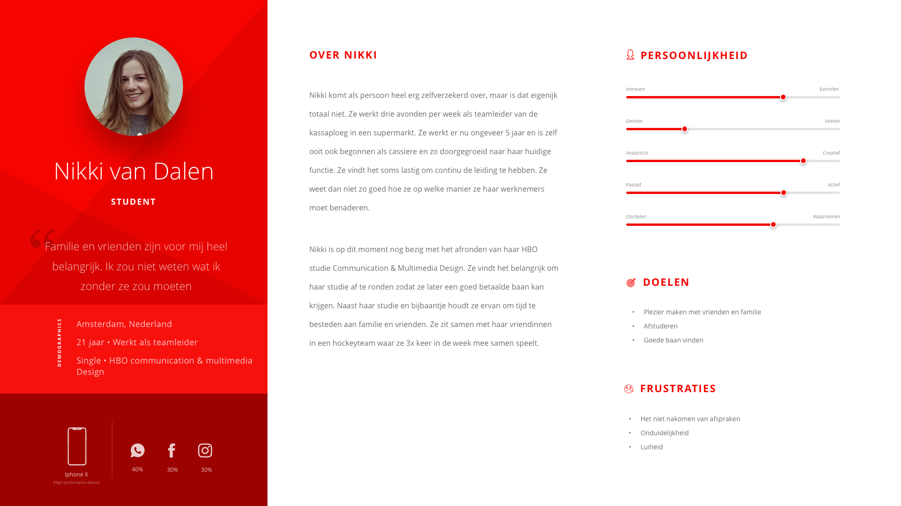

# 2.5 Persona doelgroep

## Inleiding

Op basis van de [afgenomen enquêtes](2.3.1-doelgroep.md) en [de interviews ](2.4-interviews.md)heb ik een persona van mijn doelgroep opgesteld. In het persona  kijk ik naar de leefstijl, doelen, frustraties en de persoonlijkheid. Het persona versterkt het beeld wat ik van mijn toekomstige gebruiker heb, wat een positieve werking op mijn eindproduct zal hebben. 

