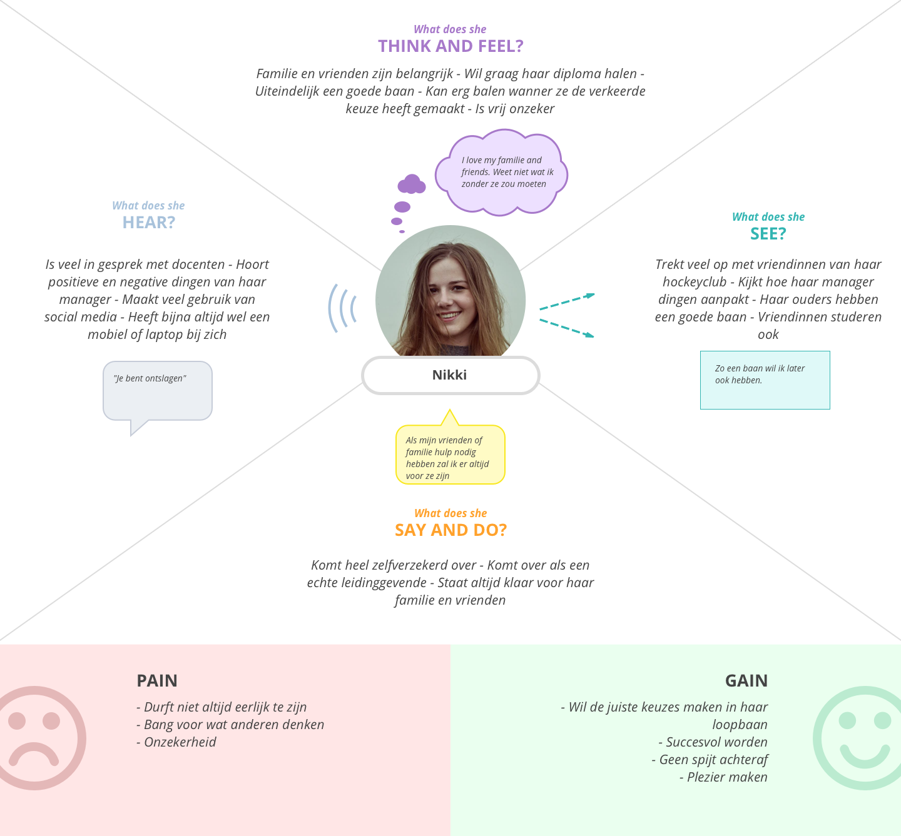

# 2.6 Empathy map

## Inleiding

Dankzij het [opgestelde persona](2.5-persona-doelgroep.md) van mijn doelgroep heb ik een beter beeld kunnen schetsen van mijn toekomstige gebruiker. Als resultaat daarvan heb ik ook een empathy map kunnen opstellen. Hierin komt naar voren wat de gebruiker hoort, denkt, voelt, ziet, zegt en doet. Daarnaast worden ook de pains & gains toegelicht.

> De **Empathy Map** is een krachtige tool. Doordat je je letterlijk in het gevoel en in de belevingswereld van je \(ideale\) klant verplaatst, ben je veel beter in staat te begrijpen waarmee je deze klant het beste van dienst kan zijn. Je krijgt hiermee een dieper inzicht in de bijdrage die je kan leveren. Bron: De Innovator \(2018\)

