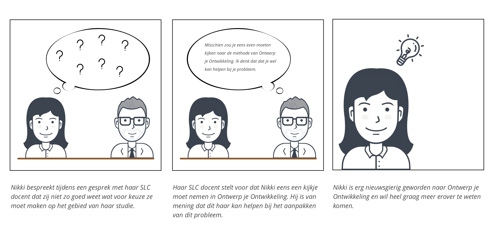
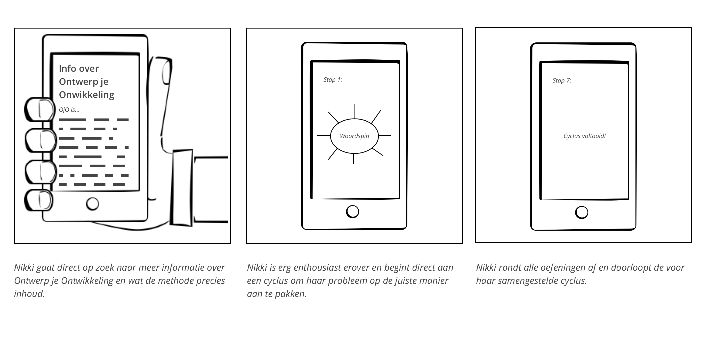
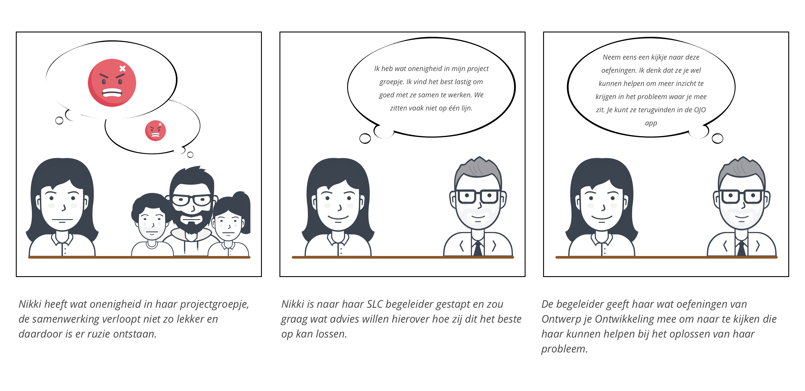
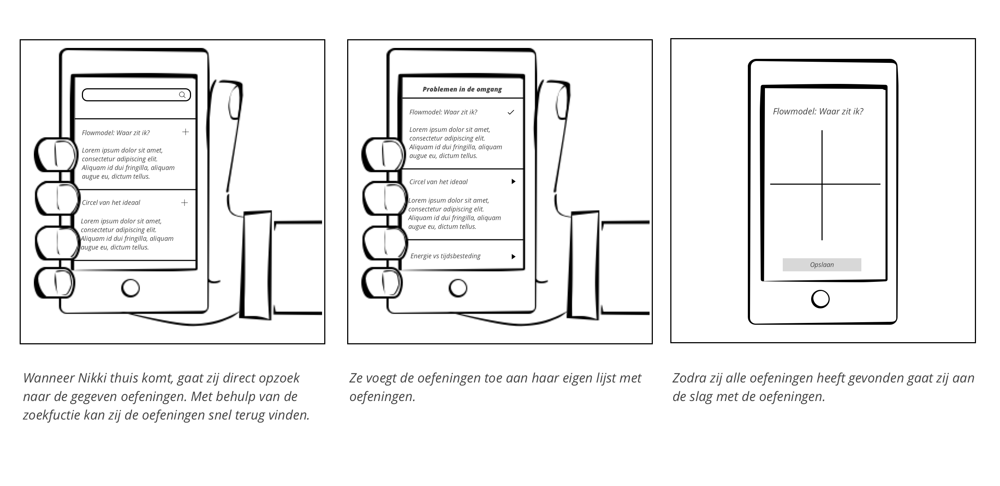
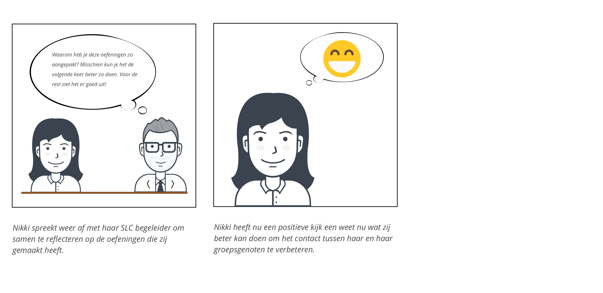
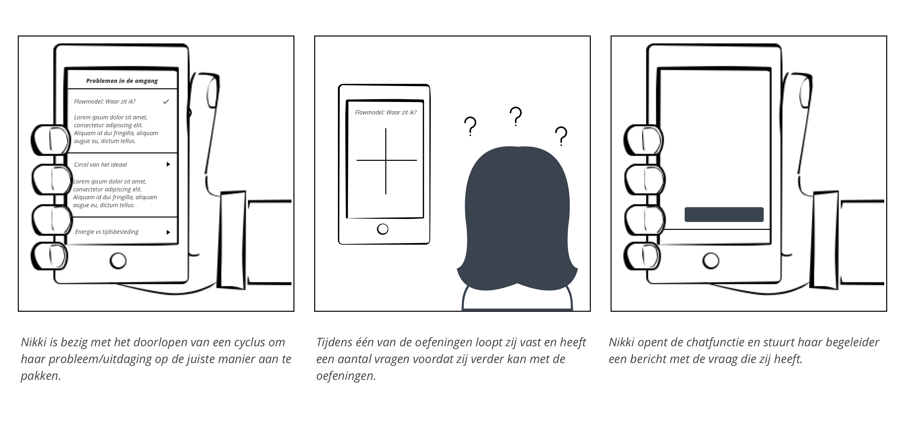
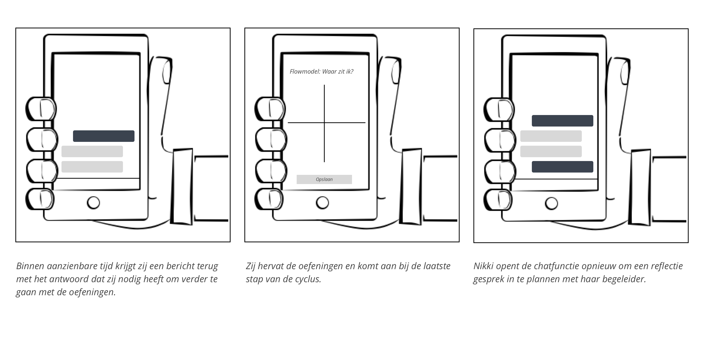
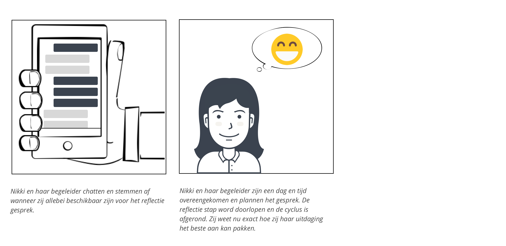

# 2.7 User stories en Scenario's

## Inleiding

Om een goed beeld te krijgen van de scenario’s waarin mijn oplossing een rol zal gaan spelen heb voor mijn gebruiker verschillende user stories opgesteld. Aansluitend daarop heb ik voor iedere user story een scenario uitgewerkt om het beeld te versterken. Hierin komen de behoeftes en gevoelens van de gebruiker naar voren en kan er uit worden gehaald op welke momenten mijn oplossing van toegevoegde waarde zal zijn. 



## **“Als gebruiker wil ik thuis zelf aan de slag kunnen gaan met de OJO methode zonder daar constante begeleiding bij nodig te hebben.”**




## **“Als gebruiker wil ik oefeningen op kunnen zoeken die ik aanbevolen heb gekregen van één van mijn docenten.”**




##  **“Als gebruiker wil ik kunnen chatten met mijn begeleider, vragen kunnen stellen en als ik bij de laatste stap ben aangekomen een reflectiegesprek kunnen inplannen.”**




  
  

