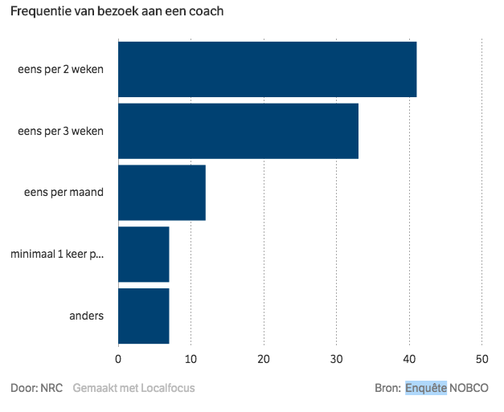
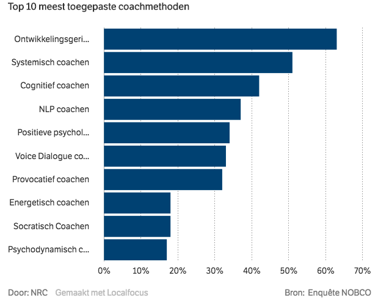
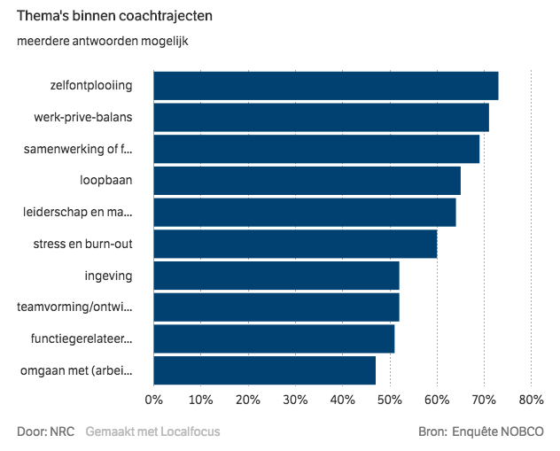

# 2.9 Literature study

## Inleiding

Om zo veel mogelijk informatie te verzamelen over \(loopbaan\)coaching, persoonlijke ontwikkeling en motivatie heb ik online gezocht naar artikelen. De belangrijkste resultaten hiervan zijn terug te vinden op deze pagina. Daarnaast zijn er vanuit elke bron mogelijke eisen verzameld voor de eerste versie van [het Programma van Eisen.](2.10-programma-van-eisen-0.5.md)

## Artikelen over \(loopbaan\)coaching

**Let op! De 4 artikelen zijn onderstaand verdeeld over meerdere tabbladen!** 



## En daar is er weer eentje: een loopbaancoach

De Veen, T. \(2016, 5 januari\). En daar is er weer eentje: een loopbaancoach. Geraadpleegd op 2 januari 2019, van [https://www.nrc.nl/nieuws/2016/01/06/me-myself-and-my-coach-1574873-a922566](https://www.nrc.nl/nieuws/2016/01/06/me-myself-and-my-coach-1574873-a922566)

### Belangrijkste bevindingen

* **En voor een coach is januari een van de drukste maanden. „Dat merk ik ieder jaar, half september en half januari”, zegt**[ ****](http://reijsconsult.nl/)**Ilse Reijs, al zestien jaar werkzaam als loopbaancoach. „In de vakantie bekijken mensen hun werkende leven even van een afstandje. Als ze bij terugkomst weer met beide benen in de realiteit staan, overvalt de onvrede hen zo erg dat ze hulp zoeken.”** _September \(begin schooljaar\) en januari \(begin na de kerstvakantie\) zijn voor coaches de drukste maanden. Mensen denken in de vakantie na over het leven, wellicht interessant om in de app rekening mee te houden. Extra mogelijkheid voor een gesprek of vragen?_ 
* **De beroepsgroep groeit: ruim 1.800 mensen hebben nu een officiële erkenning als coach door de Nederlandse orde van beroepscoaches \(NOBCO\).** 
* **De verschillen tussen coaches zijn groot – maar dat is niet per se slecht, weet Burger. „Uit ons onderzoek blijkt dat er in coaching niet maar één juiste methode is. Het belangrijkst is een goede relatie tussen coach en cliënt. Dus coaches moeten zich ontwikkelen op het gebied van empathie, authenticiteit en contact maken. Je moet als coach iets kunnen ontwikkelen.”** Belangrijk om ervoor te zorgen dat de relatie tussen coach en cliënt - en in dit geval dus ook mijn eindproduct - goed is. Empathie en authenticiteit zijn hier belangrijke factoren voor. ****




## Waarom coachen van studenten een vak apart is

Nieuwburg, H. \(z.d.\). Blog \| Waarom coachen van studenten een vak apart is. Geraadpleegd op 2 januari 2019, van [https://www.instituutmentoris.nl/publicaties/waarom-coachen-van-studenten-een-vak-apart-is/](https://www.instituutmentoris.nl/publicaties/waarom-coachen-van-studenten-een-vak-apart-is/)

### Belangrijkste bevindingen

* **Het coachen van studenten heeft direct een onderwijsbelang. De leerprestaties van de studenten worden steeds belangrijker. Individuele begeleiding heeft als resultaat: minder uitval, beter leerrendement en een snellere afronding van de opleiding. Met andere woorden: het coachen van studenten heeft direct invloed op de prestaties van de school en de onderwijsexploitatie.** 
* **Minister Jet Bussemaker van Onderwijs wil vanaf 2018 betere loopbaanbegeleiding bieden aan studenten. Hiervoor stelt ze 30 miljoen beschikbaar om uitval en verkeerde studiekeuzes van studenten te bestrijden.** 
* **Bij reguliere coaching komt de coachee met een vraag of probleem bij een coach. Studenten zullen niet snel zelf met een coachingsvraag komen, ze komen omdat de afspraak geroosterd staat.** _Interessant verschil tussen "normale" coaching en coaching van studenten._ 
* **Normaliter is de coaching gebaseerd op gelijkwaardigheid tussen coach en coachee. In het onderwijs is er altijd sprake van een machtsbasis; namelijk die van docent versus student. De gelijkwaardigheid is hiermee in het fundament uit balans.** 



## GROW coaching model

YourCoach Gent Coaching Tools. \(z.d.\). GROW coaching model \| Goal - Reality - Options - Will. Geraadpleegd op 2 januari 2019, van [https://www.yourcoach.be/coaching-tools/grow-coaching-model.php](https://www.yourcoach.be/coaching-tools/grow-coaching-model.php)

### Belangrijkste bevindingen

* **Het GROW coaching model is een beproefd model om structuur aan te brengen in een coachingsgesprek.**

  **De kracht van het GROW model is dat het in vier overzichtelijke stappen leidt tot een duidelijk eindresultaat. Doordat de gecoachte zélf actief is in het verhelderen van het probleem en het genereren van ideeën, beklijft de output beter. De gecoachte komt als het ware zélf tot oplossingen.**  

* **Het GROW coaching model is een vier-stappenplan. GROW is een afkorting voor Goal – Reality – Options – Will. Een nuttige metafoor voor het GROW coaching model is het plan dat je zou maken om een reis te ondernemen. Je begint met de kaart: waar gaan we naartoe \(Goal\), en waar zijn we nu \(Reality\)? Dan bekijk je de verschillende routes om op de bestemming te geraken \(Options\). Tenslotte kies je er één uit, en zorg je ervoor dat je motivatie om de reis te ondernemen in orde is, en dat je voorbereid bent op alle condities en obstakels.**



## De rol van een loopbaancoach bij arbeidsmobiliteit

Weidema, N. \(2017b, 9 november\). PWnet. Geraadpleegd op 2 januari 2019, van [https://www.pwnet.nl/personeelsmanagement/artikel/2017/11/de-rol-van-een-loopbaancoach-bij-arbeidsmobiliteit-10125763](https://www.pwnet.nl/personeelsmanagement/artikel/2017/11/de-rol-van-een-loopbaancoach-bij-arbeidsmobiliteit-10125763)

### Belangrijkste bevindingen

* **Brinkhuis: “Je kunt geen standaardprogramma afdraaien, maar door een heel strak interview volgens een bepaalde methodiek kun je soms in drie gesprekken erachter komen wat iemands kwaliteiten en talenten zijn.”** _Er zijn dus minimaal drie gesprekken nodig voor een coach om te achterhalen wat iemands kwaliteiten en talenten zijn, kan dit niet sneller?_ 
* **Verandering is voor de meeste mensen beangstigend, waardoor cliënten de hakken in het zand kunnen zetten.** _Het is dus belangrijk om de cliënten op hun gemak te stellen en de verandering niet beangstigend over te laten komen. Zo voorkom je dat cliënten hun hakken in het zand zetten._ 
* **Brinkhuis ziet steeds vaker dat organisaties hun eigen loopbaancoach in dienst hebben. “We komen uit een periode waarin de loopbaancoaches en mobiliteitsadviseurs werden ontslagen omdat die taken werden geoutsourced. Nu blijkt dat dat toch heel veel geld kost en dat je veel beter interne loopbaanadviseurs kunt hebben. Die kennen de organisatie en kennen de bewegingen: waar komen de nieuwe banen?** _Interessant om te lezen dat er wegens het verminderen van de kosten nu interne loopbaancoaches worden ingeschakeld. Maar is het juist goed of slecht dat een coach intern is? Kan een coach dan nog wel objectief naar het probleem kijken?_



## Artikelen over persoonlijke ontwikkeling en motivatie

**Let op! De 2 artikelen zijn onderstaand verdeeld over meerdere tabbladen!** 



## Persoonlijke groei en ontwikkeling begint met zelfkennis

Schriel, P. \(2017, 23 juli\). Persoonlijke groei en ontwikkeling begint met zelfkennis. Geraadpleegd op 2 januari 2019, van [https://patrickschriel.nl/2011/08/12/persoonlijke-groei-en-ontwikkeling-begint-met-zelfkennis/](https://patrickschriel.nl/2011/08/12/persoonlijke-groei-en-ontwikkeling-begint-met-zelfkennis/)

### Belangrijkste bevinding

* **Persoonlijke groei en ontwikkeling gaat juist over eigen verantwoordelijkheid nemen. Je bent zelf verantwoordelijk voor je eigen leven en over je eigen daden. Je bent zelf verantwoordelijk voor je eigen kwaliteiten en talenten. Je bent ook verantwoordelijk voor al jouw karaktereigenschappen en persoonlijke eigenschappen, of ze nu goed of minder goed ontwikkeld zijn.** 
* **De basisingrediënten van zelfvertrouwen zijn niet voor niets zelfacceptatie en zelfwaardering. Accepteren zoals je bent is dan ook een gezonde basis voor persoonlijke groei en ontwikkeling.** 



## Motiveren van jongeren

Motiveren van jongeren - Jonger. \(2017, 1 augustus\). Geraadpleegd op 2 januari 2019, van [https://jonger.nu/motiveren-van-jongeren/](https://jonger.nu/motiveren-van-jongeren/)

### Belangrijkste bevindingen

* **Er wordt meestal gesproken van twee soorten motivatie:**

  * **Extrinsieke motivatie: de motivatie ontstaat vanuit een externe bron. Bijvoorbeeld het vooruitzicht op een beloning of een straf bij een bepaalde handeling.**
  * **Intrinsieke motivatie:  bij deze komt de motivatie vanuit de persoon zelf. Deze handelt niet om een externe beloning te bemachtigen of een straf te ontkomen, maar vanwege de intrinsieke waarde van de activiteit op het moment zelf of voor het behalen van een doel in de toekomst.**

  **Metaforisch beschreven: bij intrinsieke motivatie draait het om het spel, en bij extrinsieke motivatie om de knikkers.**  

* **Jongeren zullen zich afvragen ‘waarom doe ik dit’ en ‘waarom is dit belangrijk voor me’. Wanneer zij geen reden vinden voor iets wat ze moeten doen zullen zij niet snel de motivatie kunnen opbrengen om hetgeen toch uit te voeren. Drijfveer is dat ze het nut inzien van waarom ze hetgeen zouden doen wat ze moeten doen.**  
* **Deel lange termijn doelen op in korte termijn doelen** 
* **Jongeren zijn minder gemotiveerd tot een handeling waarvan hij/zij verwacht dat deze nooit zal slagen of tot niets goeds zal leiden.** 
* **Plezier is het belangrijkste ingrediënt om jongeren actief en gemotiveerd deel te laten nemen aan sociale activiteiten.** 
* **Jongeren, vooral jongens, reageren vaak op concurrentie. Ongeacht hoe ondergeschikt de taak, elke klus kan worden omgevormd tot een passievolle activiteit als er een competitief aspect in betrokken is.** 



## Belangrijkste eisen:

* De relatie tussen de gebruiker en het eindproduct moet goed zijn.**\(Must have\)**
* Het eindproduct moet de relatie tussen de coach en de student bevorderen. **\(Shoud have\)**
* The tone of voice van het eindproduct moet de gebruiker het gevoel geven dat hij/zij gelijkwaardig is. **\(Must have\)**
* De gebruiker moet het gevoel krijgen dat de oefeningen tot iets goeds leiden. **\(Must have\)**
* De oplossing moet de intrinsieke motivatie triggeren. **\(Should have\)**

Om zo veel mogelijk informatie te verzamelen over loopbaancoaching en persoonlijke ontwikkeling en groei heb ik online gezocht naar artikelen. De belangrijkste resultaten hiervan zijn terug te vinden op deze pagina. Daarnaast zijn er vanuit elke bron mogelijke eisen verzameld voor de eerste versie van het [Programma van Eisen.](2.10-programma-van-eisen-0.5.md)

## Artikelen over loopbaancoaching



## De rol van een loopbaancoach bij arbeidsmobiliteit

Weidema, N. \(2017b, 9 november\). PWnet. Geraadpleegd op 9 januari 2019, van [https://www.pwnet.nl/personeelsmanagement/artikel/2017/11/de-rol-van-een-loopbaancoach-bij-arbeidsmobiliteit-10125763](https://www.pwnet.nl/personeelsmanagement/artikel/2017/11/de-rol-van-een-loopbaancoach-bij-arbeidsmobiliteit-10125763)

### Belangrijkste bevindingen

* **Brinkhuis: “Je kunt geen standaardprogramma afdraaien, maar door een heel strak interview volgens een bepaalde methodiek kun je soms in drie gesprekken erachter komen wat iemands kwaliteiten en talenten zijn.”** _Er zijn dus minimaal drie gesprekken nodig voor een coach om te achterhalen wat iemands kwaliteiten en talenten zijn, kan dit niet sneller?_ 
* **Verandering is voor de meeste mensen beangstigend, waardoor cliënten de hakken in het zand kunnen zetten.** Het is dus belangrijk om de cliënten op hun gemak te stellen en de verandering niet beangstigend over te laten komen. Zo voorkom je dat 

  







