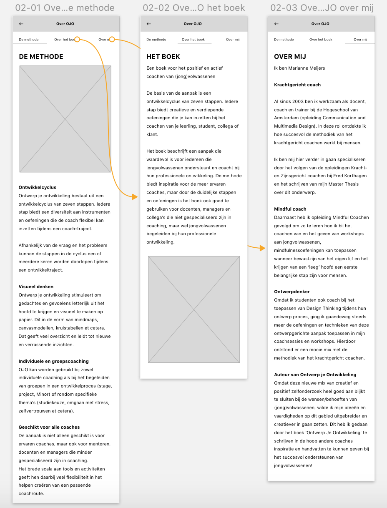
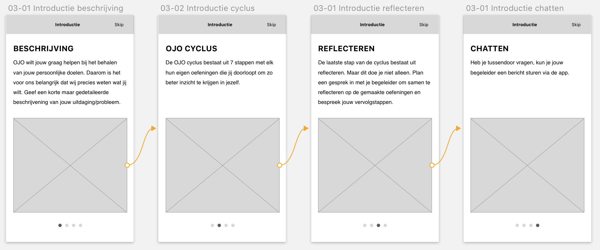

# 4.1.1 Test + Resultaten

## Inleiding

Het eerste prototype heb ik zo snel mogelijk getest met de opdrachtgever. Dit was een kleine test en het doel van de test was om te kijken of het concept helder is en de algemene interactie. En natuurlijk om daarnaast te controleren of zij tevreden is met het concept. Met de feedback hiervan kan ik vervolgens aan de slag gaan met[ Prototype 0.5](../4.3-prototype-0.5/).

## De test

Ter voorbereiding op deze test heb ik het prototype werkend gemaakt met behulp van Principle. Zo kan er door de app geklikt worden alsof alles echt werkt.

Ik ben begonnen met het bespreken van elke pagina en te kijken of alles helder is. Op de volgende pagina's heb ik gerichte feedback gekregen en hebben we gebrainstormd hoe dit beter aangepakt kan worden.

### 2.0 Over OJO

De opmaak is helder en goed uitgevoerd. Maar wat als de gebruiker deze informatie nog een keer wil bekijken? Op dit moment is het alleen mogelijk om deze informatie te bekijken voor het inloggen. Het moet mogelijk zijn om het terug te vinden als je eenmaal bent ingelogd.

### 4.0 Uitleg

Volgens de opdrachtgever komt de introductie niet op het juiste moment. Dit is nu namelijk direct na de registratie/inloggen. "Waarom wordt deze introductie niet getoond wanneer de gebruiker begint aan een cyclus? Dit lijkt logischer omdat er instructies in voor komen die de gebruiker direct daarna moet uitvoeren."

### Algemene feedback & tips

Verder hebben we nog gebrainstormd over welke dingen ik ben vergeten of die ik nog kan toevoegen. Zo kwam uit het gesprek dat het makkelijker is om een chatfunctie toe te voegen, zodat de gebruiker op elk gewenst moment contact op kan nemen met de begeleider met vragen en voor het inplannen van het reflectie moment.

Wat nog meer naar voren kwam uit het gesprek is dat het mogelijk moet kunnen zijn om een afbeelding te uploaden. Als de gebruiker een oefening liever niet op zijn of haar mobiel uitvoert, moet de oefening toch aan de app kunnen worden toegevoegd. 

Een belangrijke tip die ik kreeg tijdens dit gesprek is dat het interessant zou kunnen zijn om een hele cyclus uit te werken als prototype. Zo kan de gebruiker ervaren hoe het is om een hele cyclus te doorlopen. En zo kan ik valideren of elke oefening ook daadwerkelijk te doen is op een mobiel device.

## Belangrijke resultaten:

* Over OJO moet terug komen in de app en niet alleen bij het inloggen/registreren
* Introductie moet pas getoond worden bij het starten van een nieuwe cyclus
* Chatfunctie
* Mogelijkheid om een afbeelding toe te voegen aan een oefening

