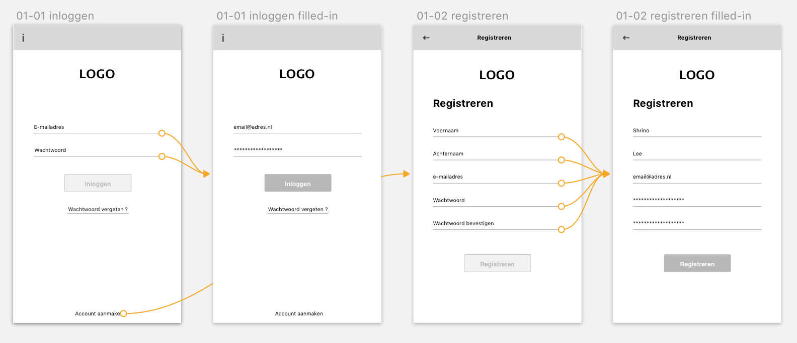
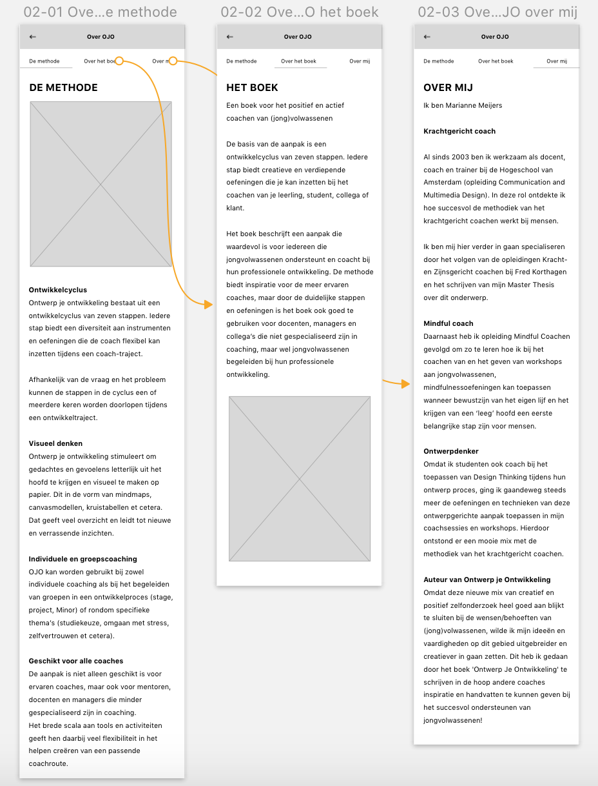
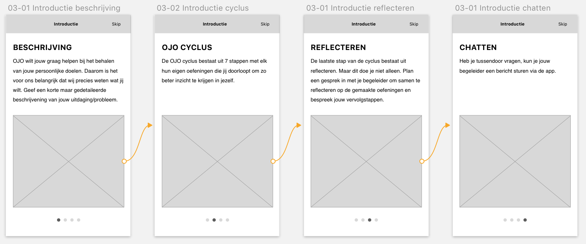
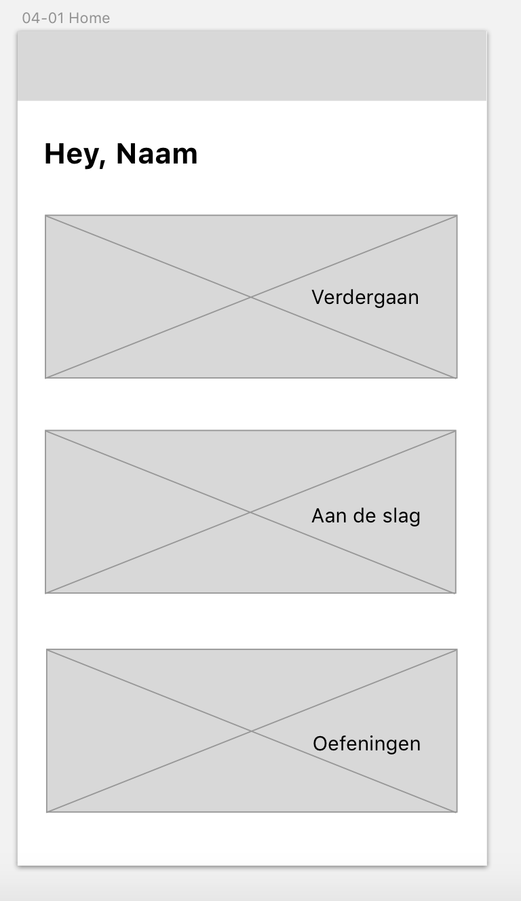
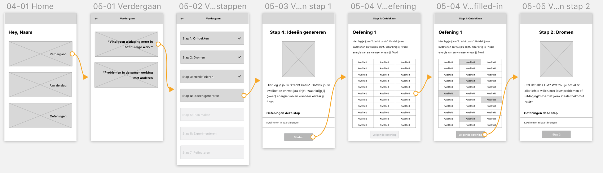
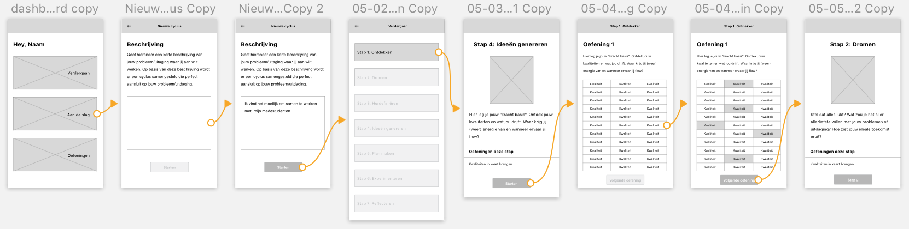
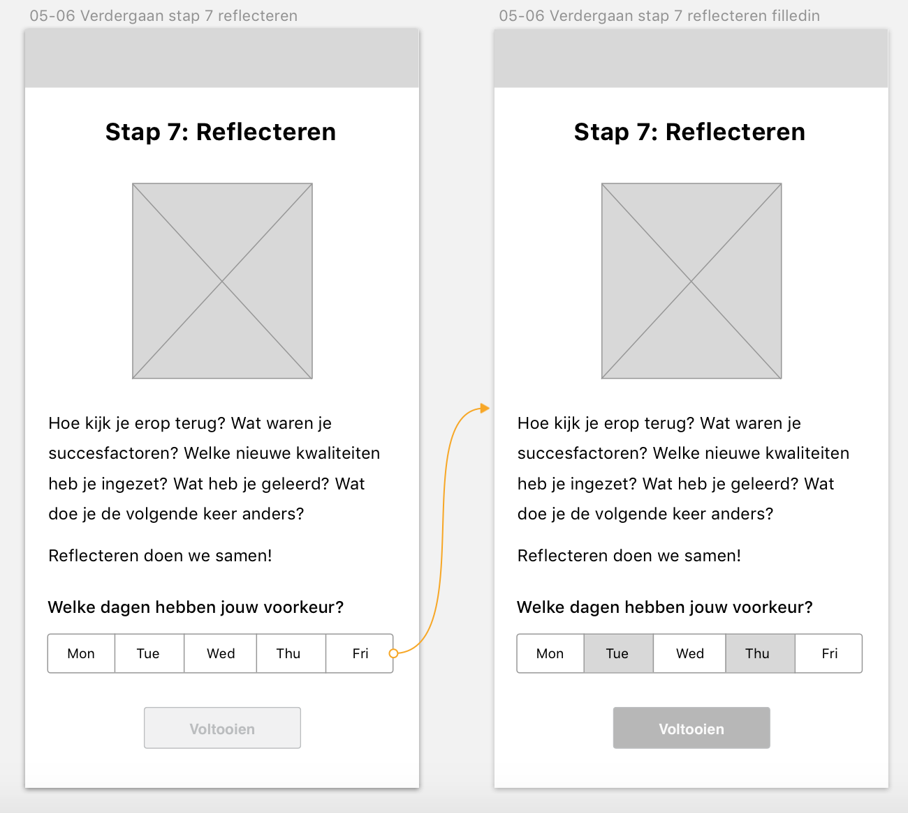
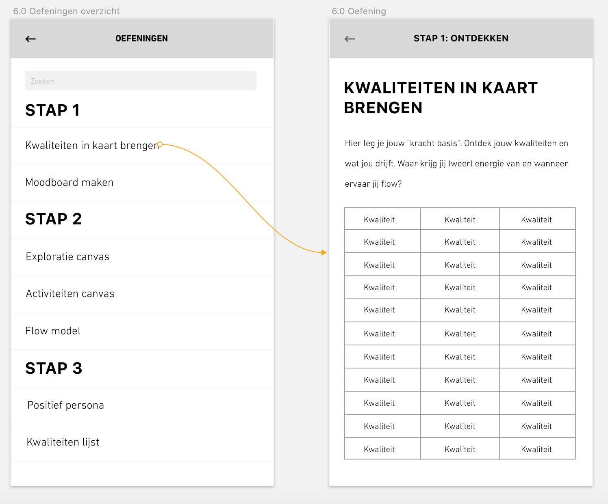

# 4.1 Prototype 0.2

Gebaseerd op [het eerste concept](../../untitled/3.1-eerste-versie-concept.md) en [Sitemap 0.5](../../untitled/3.3-sitemap-0.5.md) zijn de eerste wireframes ontwikkeld, zodat ik deze kan testen met mijn opdrachtgever. In dit lo-fi prototype vond ik het belangrijk om te kijken of het concept, de flow en de mogelijkheden helder zouden zijn.

### 1.0 Inloggen + 3.0 Registeren

Om het zo makkelijk mogelijk te maken voor de gebruiker heeft hij bij het inloggen alleen een e-mailadres en wachtwoord nodig. Bij het registreren wordt deze tevens ook gevraagd. Daarnaast moet de gebruiker bij het registreren zijn volledige naam opgeven zodat hij/zij in de app persoonlijk kan worden aangesproken. Dit zorgt ervoor dat de gebruiker het gevoel krijgt echt een connectie met de app te hebben.

### 2.0 Over OJO

Wanneer de gebruiker eerst meer informatie wil hebben over Ontwerp je Ontwikkeling kan hij/zij ervoor kiezen om meer informatie te bekijken. Hier wordt er in verschillende tabbladen uitleg gegeven over het boek, de methode en over de schrijfster van het boek.

### **4.0 Uitleg**

Bij de eerste keer inloggen krijgt de gebruiker direct een introductie van de methode te zien. Hierin komt naar voren wat er van de gebruiker verwacht wordt en wat het doel van de oefeningen is. Wanneer de gebruiker voor de 2e keer inlogt wordt deze introductie niet meer getoond.

### 5.0 Home

Als de gebruiker de introductie heeft doorlopen komt de gebruiker terecht op de Homepagina terecht. Op de Homepagina krijgt de gebruiker de keuze uit 3 opties. De opties zijn: 'Verdergaan' 'Aan de slag' en 'Oefeningen'.

### **6.0 Verdergaan**

Hier krijgt de gebruiker de keuze om verder te gaan met een nog niet afgeronde cyclus. Hier wordt een lijst getoond met actieve cyclussen. Na gekozen te hebben welke cyclus hij wilt hervatten gaat hij verder met de oefening waar hij is gestopt.

### **7.0 Aan de slag**

Als de gebruiker aan een nieuwe cyclus wil beginnen, moet hij/zij eerst het probleem/uitdaging invoeren. Op basis van deze beschrijving zal de app een speciaal samengestelde cyclus ontwerpen met oefeningen die exact aansluiten op het probleem/uitdaging van de gebruiker.

Elke oefening in de app is gekoppeld aan een aantal kernwoorden. Zodra de gebruiker één van de kernwoorden invoert bij de omschrijving van het probleem/uitdaging, wordt de juiste oefening gevonden.

Na het beschrijven van het probleem/uitdaging zal de gebruiker elke stap doorlopen en de daarbij behorende oefeningen uitvoeren.

### **9.0 Stap 7: Reflecteren**

Zodra de gebruiker is aangekomen bij de laatste stap van de cyclus, \(Stap 7: reflecteren\), kan er een gesprek ingepland worden met de begeleider. Door aan te geven welke dagen de gebruiker beschikbaar is wordt er een bericht gestuurd naar de begeleider zodat hij/zij hier rekening mee kan houden.

### **10**.0 Oefeningen

Hier kan de gebruiker zelfstandig op zoek gaan naar oefeningen. Met behulp van een zoekfunctie kan de gebruiker makkelijk oefeningen opzoeken. Ook kan de gebruiker opgezochte oefeningen toevoegen aan een zelf samengestelde cyclus.

