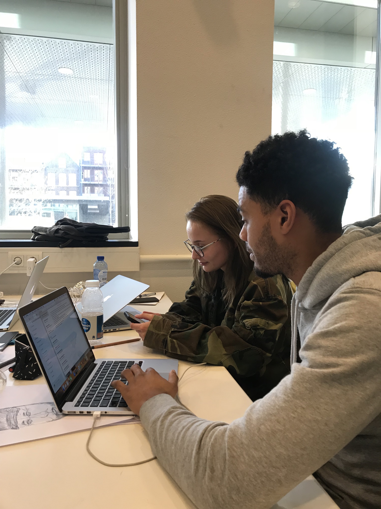
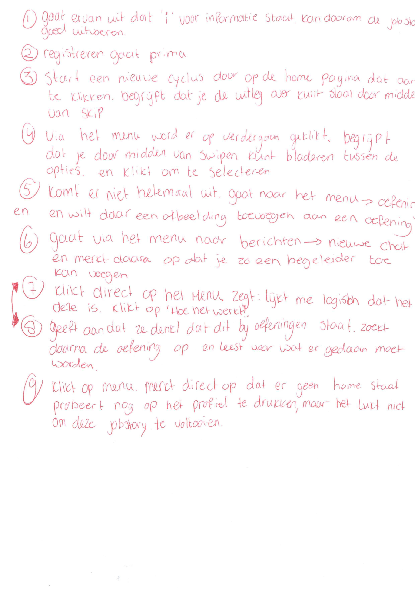
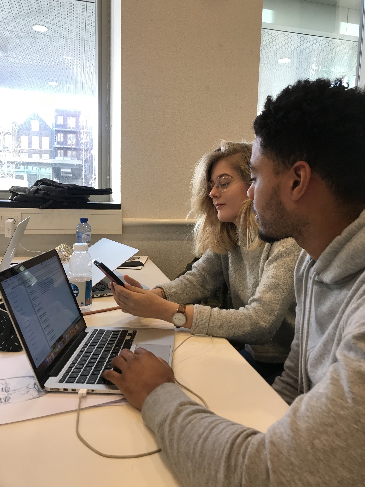
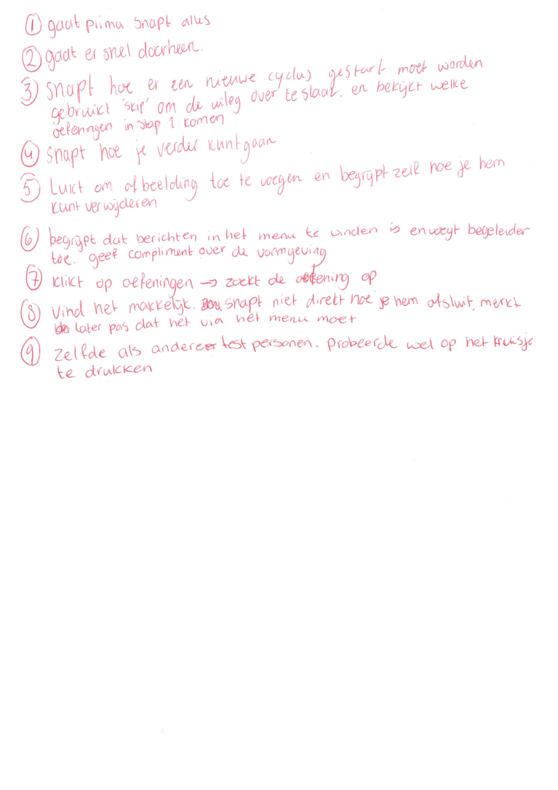
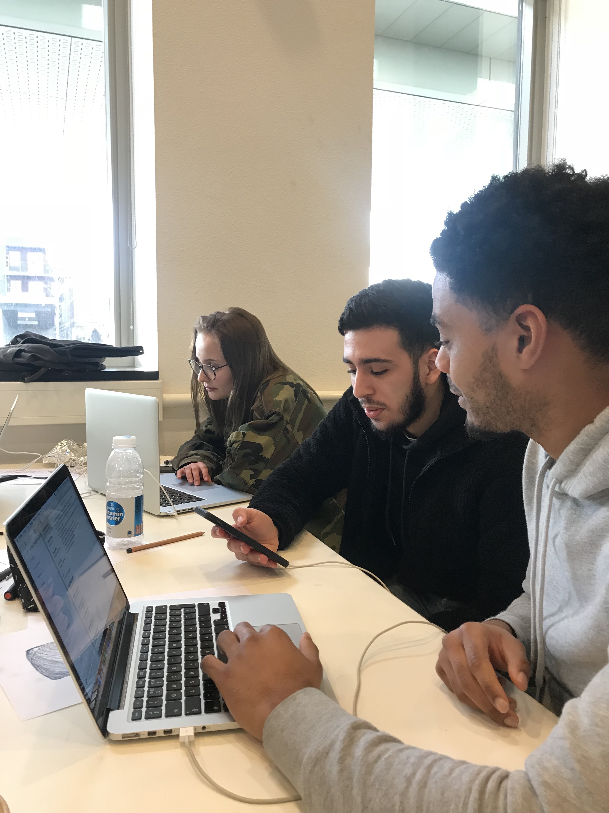
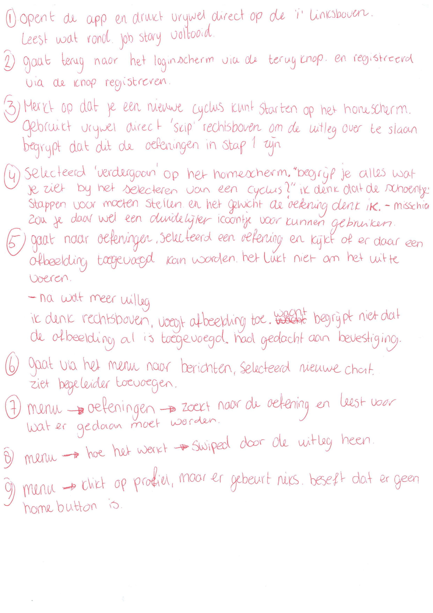

# 4.3.1 Test + Resultaten

## Inleiding

Mijn doel was om [Prototype 0.5](./) te testen met minimaal 5 personen. Tijdens de test merkte ik echter dat te testpersonen telkens tegen dezelfde fouten aanliepen. Ik had voor de test uiteindelijk aan 4 testpersonen genoeg. Als voorbereiding op de test heb ik het prototype eerst werkend gemaakt in Sketch Prototype. Daarnaast heb ik 9 Job Stories opgesteld die de testpersonen moeten uit te voeren. De Job Stories zijn gericht op de basisfuncties van de app, zoals het starten van een nieuwe cyclus, het zoeken naar oefeningen en het versturen van berichten. Zo hoop ik er achter te komen of alle functionaliteiten probleemloos uit te voeren zijn. Tijdens het testen heb ik notities gemaakt met dingen die goed gingen en die minder goed gingen. 

De voorbereiding op de test, de uitwerking van de test zelf en de belangrijkste resultaten zijn terug te vinden op deze pagina.

### Job Stories:

1. Je wil meer informatie weten over de methode en de schrijfster, maar je wilt geen account maken.
2. Je vindt Ontwerp je Ontwikkeling interessant en wilt graag een account aanmaken.
3. Je wil een nieuwe cyclus starten, maar je weet al hoe het werkt. Daarna ben je benieuwd welke oefeningen stap 1 van jouw nieuwe cyclus bevat.
4. Je bent tussentijds gestopt en wil graag verder gaan met de cyclus ‘ONZEKERHEID BELEMMERT MIJ IN MIJN FUNCTIONEREN’.
5. Je wil graag een afbeelding toevoegen aan één van de oefeningen.
6. Je wil je begeleider graag toevoegen zodat je hem een bericht kunt sturen.
7. Je bent benieuwd wat je moet doen bij de oefening ‘de cirkel van het ideaal’.
8. Je bent vergeten hoe sommige dingen werken.
9. Je wil terug naar de homepagina.

## Testpersoon 1: Berat

## Testpersoon 2: Chiara

## Testpersoon 3: Rianne

## Testpersoon 4: Sulayman

## Conclusie:

Veel van de Job Stories werden door alle testpersonen probleemloos uitgevoerd. Het opvallende aan de test was dat alle testpersonen ook dezelfde problemen ondervonden. Om te beginnen was dit bij Job story 5, het toevoegen van een afbeelding. 3 van de 4 testpersonen ging naar 'oefeningen' om daar een afbeelding toe te voegen aan een oefening. Bij de 3e testpersoon ontdekte ik dat de Job Story onduidelijk was. Na dat ik het beter had uitgelegd gaven de testpersonen aan dat het icoontje rechts boven in de hoek niet goed opvalt en dat zij er eigenlijk overheen keken. Zij gaven als tip om het nog een keer extra terug te laten komen op de pagina in de vorm van een button of iets dergelijks. Daarnaast was en nog 1 testpersoon die op een bevestiging wachtte dat het is gelukt om de afbeelding toe te voegen.

Naast dit probleem liep elk testpersoon vast bij de laatste Job Story daar kwam ik er ook al snel na de eerste testpersoon achter dat er geen button is om terug te keren naar de homepagina en geen manier om het menu af te sluiten. Dit is dan ook iets wat ik aan mijn volgende versie toe moet voegen.

Eén testpersoon gaf aan dat het niet helemaal duidelijk is dat je 'Hoe het werkt?' afsluit door middel van het menu en vervolgens naar een andere pagina te gaan.

Alle aanpassingen worden verwerkt in [Prototype 0.8.](../4.4-prototype-0.9/)  

