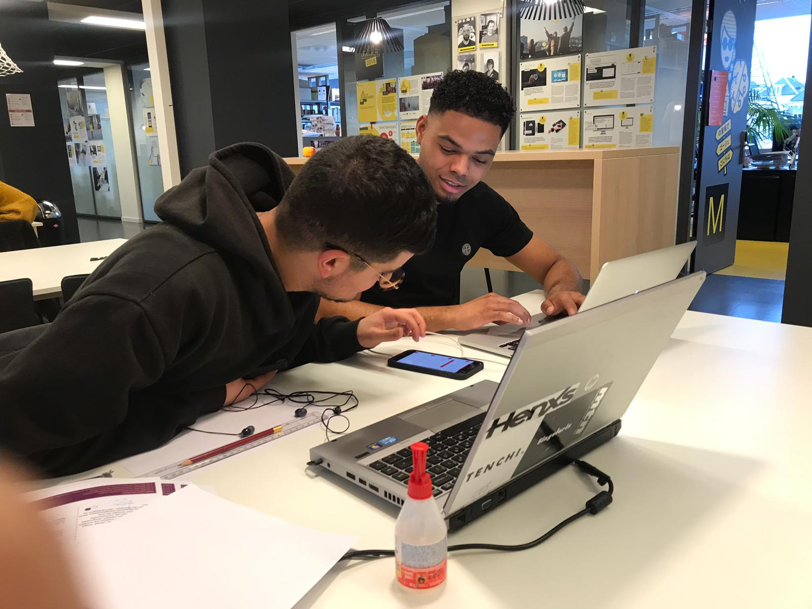
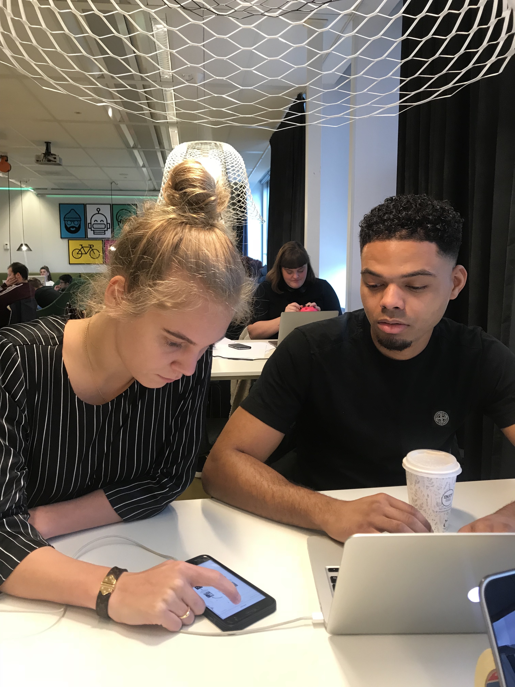
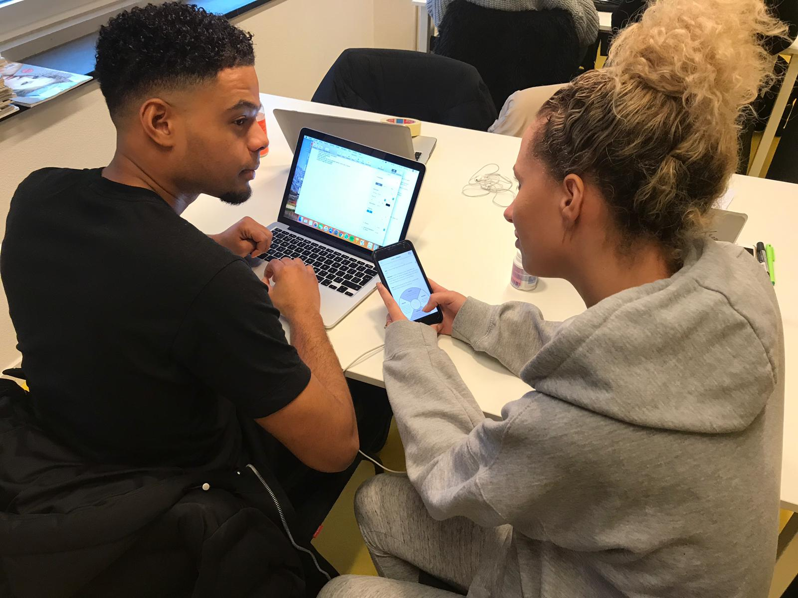

# 4.4.1 Test + Resultaten

## Inleiding

[Prototype 0.8](./) heb ik getest op nieuwe testpersonen. Het doel van de test was om te controleren of de opgestelde Job Stories nu beter uit te voeren zijn. Als voorbereiding op de test heb ik ook dit prototype werkend gemaakt in Sketch. Daarnaast heb ik 9 Job Stories opgesteld die de testpersonen moeten proberen uit te voeren. Deze Job Stories zijn gericht op de basisfuncties van de app, zoals het starten van een nieuwe cyclus, het zoeken naar oefeningen en het versturen van berichten. Tijdens het testen heb ik notities gemaakt met dingen die goed gingen en die minder goed gingen. 

De voorbereiding op de test, de uitwerking van de test zelf en de belangrijkste resultaten zijn terug te vinden op deze pagina.

Na afloop van de test heb ik ook een co-creation sessie gehouden met mijn testpersonen. Het doel van de sessie was om samen met de doelgroep te brainstormen over het eindproduct. Zo creëer je ruimte voor nieuwe ideeën en inspiratie. [ De uitwerking van de sessie is hier terug te vinden. ](4.4.2-co-creation-sessie.md)

### Job Stories:

1. Je wilt meer informatie weten over de methode en de schrijfster, maar je wilt geen account maken.
2. Je vindt Ontwerp je Ontwikkeling interessant en wilt graag een account aanmaken.
3. Je wilt een nieuwe cyclus starten, maar je weet al hoe het werkt. Daarna ben je benieuwd welke oefeningen stap 1 van jouw nieuwe cyclus bevat.
4. Je bent tussentijds gestopt en wil graag verder gaan met de cyclus ‘ONZEKERHEID BELEMMERT MIJ IN MIJN FUNCTIONEREN’
5. Je wilt graag een afbeelding toevoegen aan een de oefening waar je nu mee bezig bent.

   Je wilt je begeleider graag toevoegen zodat je hem een bericht kunt sturen.

6. Je bent benieuwd wat je moet doen bij de oefening ‘de cirkel van het ideaal’.
7. Je bent vergeten hoe sommige dingen werken.
8. Je wilt terug naar de homepagina.

## Testpersoon 1: Ouail

1. Opent de app. Begrijpt dat de i links boven staat voor informatie. Daar leest hij wat meer over de schrijfster en over de methode. Begrijpt dat hij kan swipen naar de andere kopjes.
2. Klikt links boven op de back button en komt daardoor terug op de login pagina. Klikt op registreren. Geeft wel aan dat deze button inactief lijkt. Maar gaat wel verder met het registreren. 
3. Ziet op de home pagina ‘start nieuwe cyclus’ staan. Komt daarna terecht op de uitleg pagina en ziet linksboven skip staan. Begrijpt dat je daarmee de volledige uitleg overslaat.
4. Start weer op het homescherm en klikt vervolgens op verdergaan. Daarna swiped hij om te zoeken naar de cyclus die hij wilt hervatten. Eenmaal gevonden begrijpt hij dat hij moet klikken om de cyclus te hervatten.
5. Ziet onder aan de oefening ‘upload image’ staan en drukt hier vervolgens op. Het toevoegen van een afbeelding gaat goed. Merkt daarna dat het ook via een icoontje rechts boven kan.
6. Gaat via het menu naar berichten. Kijkt wat rond en ziet vervolgens rechtsboven het icoontje om een nieuwe chat te starten. Vervolgens zien hij staan ‘nieuwe begeleider toevoegen’ en voegt zijn begeleider toe.
7. Klikt als eerst op het menu. Gaat naar oefeningen. Daar zoekt hij in de lijst naar de oefeningen die hij wilt bekijken. Merkt de zoekbalk niet direct op. Geeft daarna aan dat hij hem niet heeft gezien.
8. Menu -&gt; Hoe het werk. Swiped door de uitleg heen.
9. Drukt weer op menu en ziet Home staan. Keert vervolgens terug naar de homepagina.

## Testpersoon 2: Demi

1. Het opzoek dan informatie gaat goed. Ziet dat je via de i linksboven meer informatie kan lezen.
2. Via registeren wordt er een account aangemaakt. Dit gaat ook goed en zonder problemen.
3. Via de homepaigna kan je een nieuwe cyclus starten via de knop. Links boven kun je op skip klikken waardoor de hele uitleg wordt overgeslagen. Ziet onder ‘oefeningen stap 1’ de oefeningen staan die in deze stap voorkomen.
4. Op de homepagina klikt ze op verdergaan. Swiped door de cyclussen om de juiste te vinden. En drukt erop wanneer ze de juiste heeft gevonden.
5. Kijkt rond op de pagina en merkt recht boven op dat je daar een afbeelding toe kunt voegen. Voegt vervolens zonder problemen een afbeelding toe. Merkt niet op dat het ook via een button gedaan kon worden.
6. Klikt op menu en gaat naar berichten. Herkent het icoontje recht boven van whats app en neemt aan dat je daar een nieuwe chat kunt starten. Klikt erop en ziet dat ze daar een begeleider kan toevoegen. Voegt daarna zonder moeite een begeleider toe.
7. Gaat naar het menu en klikt vrijwel direct op oefeningen. Scrolt door de lijst om de oefening te zoeken. Eenmaak gevonden klikt ze erop en leest wat de oefening inhoud. Geeft later ook aan de zoekbalk niet gezien te hebben.
8. Klikt het menu open en merkt ‘Hoe het werkt op’. Swiped vervolgens door de uitleg heen.
9. Opent het menu en ziet direct bovenin ‘home’ en keert terug naar de home pagina.

## Testpersoon 3: Kendra

1. Merkt rechtsboven de ‘i’ voor meer informatie op. Gaat er van uit dat ze daar de informatie kan vinden die ze nodig heeft. Swiped daarna door de kopjes en leest de informatie. Het opzoeken van deze informatie zonder een account te maken lukt.
2. Registreerd via de button onderop. Het lukt om een account aan te maken.
3. Op de homepagina drukt ze vrijwel direct op nieuwe cyclus starten. Merkt rechtsboven skip op en slaat de uitleg over. Bekijkt daarna de oefeningen. Ook deze stap word probleemloos uitgevoerd.
4. Via het menu gaat drukt ze op verdergaan. Vervolgens zoekt ze naar de juiste cyclus.
5. Bekijkt eerst de oefening en merkt vervolgens de knop onderaan de pagina om een afbeelding toe te voegen. Voegt vervolgens de afbeelding toe
6. Via het menu gaat ze naar berichten. Vervolgens klikt ze rechtsboven om een nieuwe chat te starten. Ziet vervolgens dat je daar een begeleider toe kunt voegen. Voegt de begeleider toe en start vervolgens een chat met hem.
7. Gaat via het menu naar Oefeningen. Daar zoekt ze naar de juiste oefening en leest wat de oefening in houdt. Ook deze testpersoon geeft aan de zoekbalk niet gezien te hebben.
8. Via het menu gaat ze naar ‘hoe het werkt?’ Swiped door de uitleg heen
9. Klikt op het menu en drukt op home. Ze keert vervolgens terug naar de hompagina.

## Conclusie:

Na de aanpassingen die ik heb gedaan voor mijn [Prototype 0.9](./) heb ik weer een test afgenomen om te kijken of deze aanpassingen niet wel goed door de test komen. Deze keer werken alle Job Stories probleemloos uitgevoerd. 

Om dat ik vind dat er altijd plaats is voor verbetering heb ik samen met de testpersonen een Co-Creation gehouden en hebben we samen mijn app nog een keer doorgesproken om te kijken of er nog dingen verbeterd konden worden. De uitwerking van de Co-Creation is hier terug te vinden. 

Veel van de Job Stories werden door alle testpersonen nagenoeg probleemloos uitgevoerd. Het opvallende aan deze test was dat alle testpersonen ook dezelfde problemen ondervonden. Om te beginnen was dit bij Job story 5, het toevoegen van een afbeelding. 3 van de 4 testpersonen ging naar 'oefeningen' om daar een afbeelding toe te voegen aan een oefening. Bij de 3e testpersoon ontdekte ik dat de Job Story onduidelijk was. Na dat ik het beter had uitgelegd gaven de testpersonen aan dat het icoontje rechts boven in de hoek niet goed opvalt en dat zij er eigenlijk overheen keken. Zij gaven als tip om het nog een keer extra terug te laten komen op de pagina in de vorm van een button of iets dergelijks. Daarnaast was en nog 1 testpersoon die op een bevestiging wachtte dat het is gelukt om de afbeelding toe te voegen.

Naast dit probleem liep elk testpersoon vast bij de laatste Job Story daar kwam ik er ook al snel na de eerste testpersoon achter dat er geen button is om terug te keren naar de homepagina. Dit is dan ook iets wat ik aan mijn volgende versie toe moet voegen.

Eén testpersoon gaf aan dat het niet helemaal duidelijk is dat je 'Hoe het werkt?' afsluit door middel van het menu en vervolgens naar een andere pagina te gaan.

Alle aanpassingen worden verwerkt in [Prototype 0.9](./).

