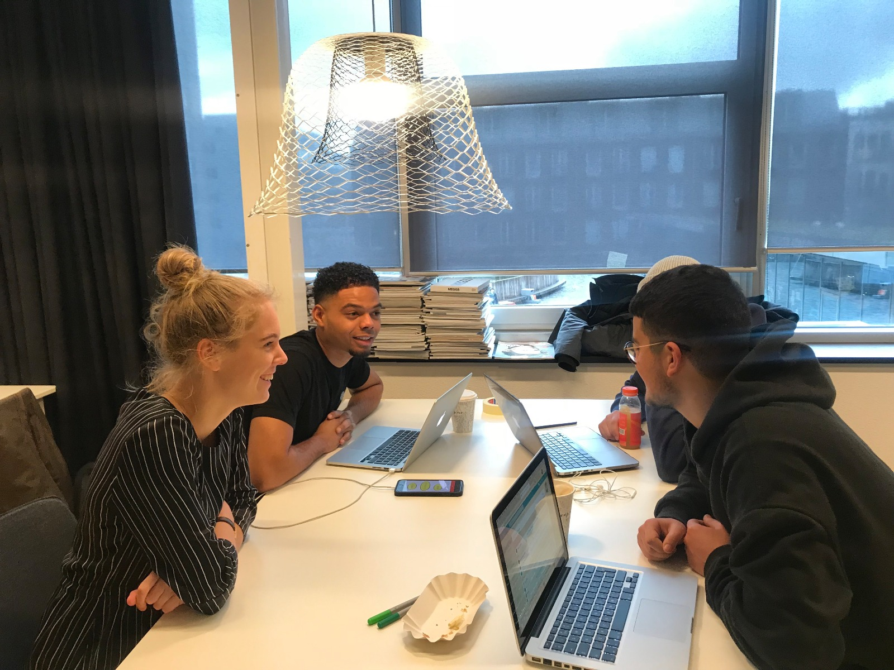

# 4.4.2 Co-creation sessie

## Inleiding

Na afloop van [de test van Prototype 0.8](4.4.1-test-+-resultaten.md) heb ik een op 11 januari een Co-creation sessie gehad met 3 studenten van de opleiding Communication & Multimedia Design. 

> **Cocreatie** is een vorm van samenwerking, waarbij alle deelnemers invloed hebben op het proces en het resultaat van dit proces, zoals een plan, advies of product.  \(Bron: Wikipedia\)

Het doel van de sessie was om gezamenlijk met de doelgroep nieuwe ideeën en inspiratie doen voor het eindproduct. Door de doelgroep hier direct bij te betrekken in de sessie, zorg je ervoor dat het eindproduct volledig aansluit op de wensen en behoeften van de gebruiker. 

De resultaten uit de sessie zijn volledig terug te vinden op deze pagina en zullen verwerkt worden in de volgende versie van het prototype: [Prototype 0.9](../4.5-prototype-0.9/).

## Resultaten co-creation sessie:

* **Splashscreen automatisch naar volgende pagina.**  _Het splashscreen moet automatisch overvloeien naar de volgende pagina._ 
* **Apart inlogscherm, dus een welkomstscherm met 2 buttons, inloggen en registreren.**   
  _Er werd als tip gegeven dat het beter zou zijn als de gebruiker eerst zou moeten kiezen tussen inloggen en registreren, en daarna pas verder in het inlogproces._

* **Registreren button lijkt niet actief.** _Button moet worden aangepast._  
* **Registreren met afbeelding.**  _Gebruiker moet bij het registreren de mogelijkheid krijgen om een afbeelding te uploaden._ ****
* **Non active buttons.**  _Bij de oefeningen en inloggen buttons non-active maken als er nog niks is ingevuld._ ****
* **Verplicht sterretjes bij inloggen.** _Zo kan de gebruiker niet inloggen zonder het invullen van de verplichte velden._  
* **Verdergaan is een abstracte term, verander naar 'cyclus hervatten'.** _De term 'verdergaan' was niet duidelijk genoeg. ****_
* **State homescreen voor als er nog nooit een cyclus is gestart.**  _Verschillende states van homescreen uitwerken. Hoe ziet het homescreen er uit als je de app voor de eerste keer gebruikt?_ ****
* **Het woord 'image' naar 'afbeelding' veranderen.**  _De app is gewoon Nederlands, dus niet onnodig Engelse termen gebruiken._ ****
* **Zoekbalk groter maken.** _Huidige zoekbalk is iets te klein volgens de testpersonen._ ****
* **Geen berichten kan je een gesprek starten, extra call to action.** _Als er geen berichten zijn, moet er in het midden een extra call to action komen om een gesprek te starten._   ****
* **Profielfoto bij docenten.** _Het zou volgens de testpersonen leuk zijn als je bij de docenten ook profielfoto's ziet._  

