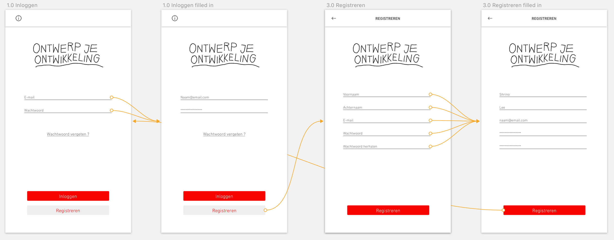
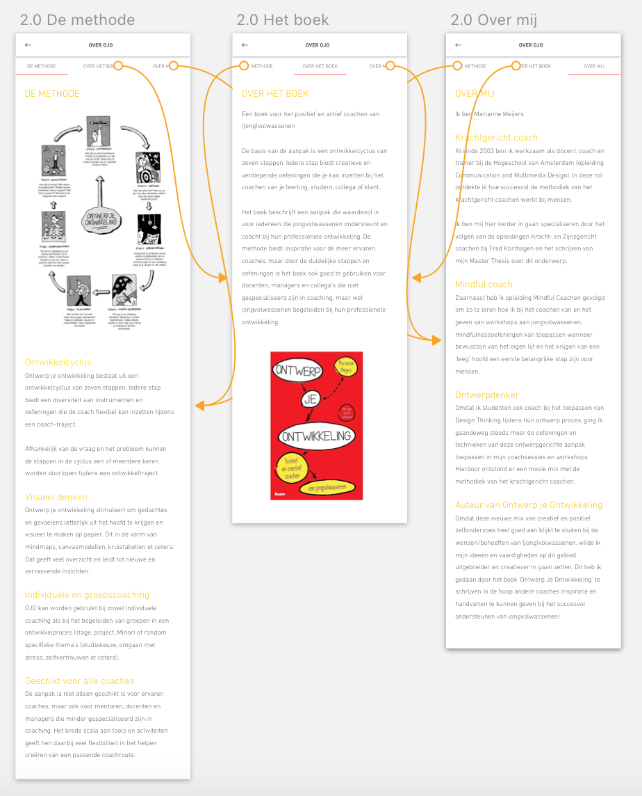
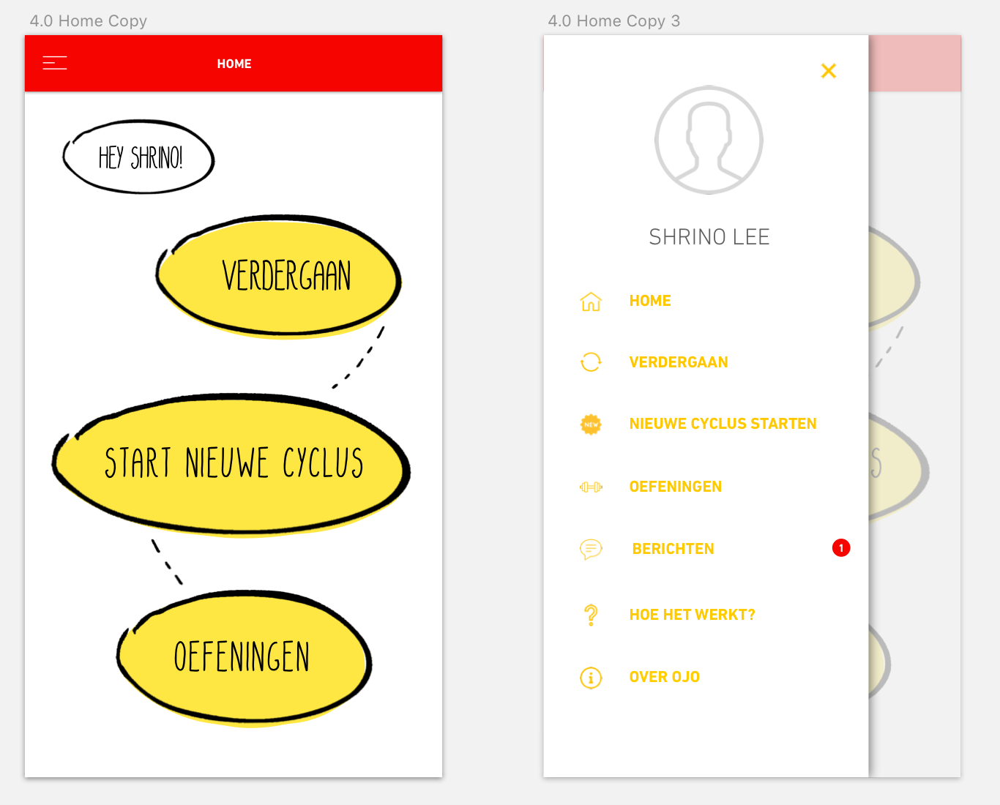
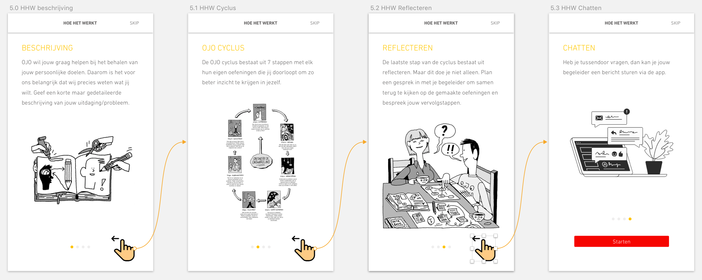
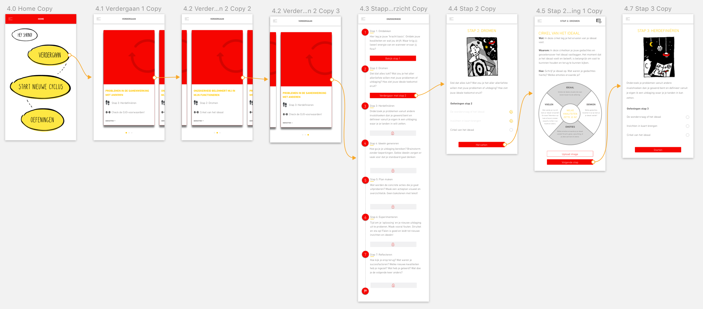
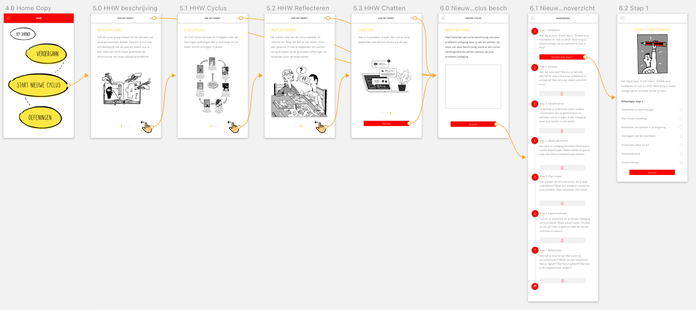
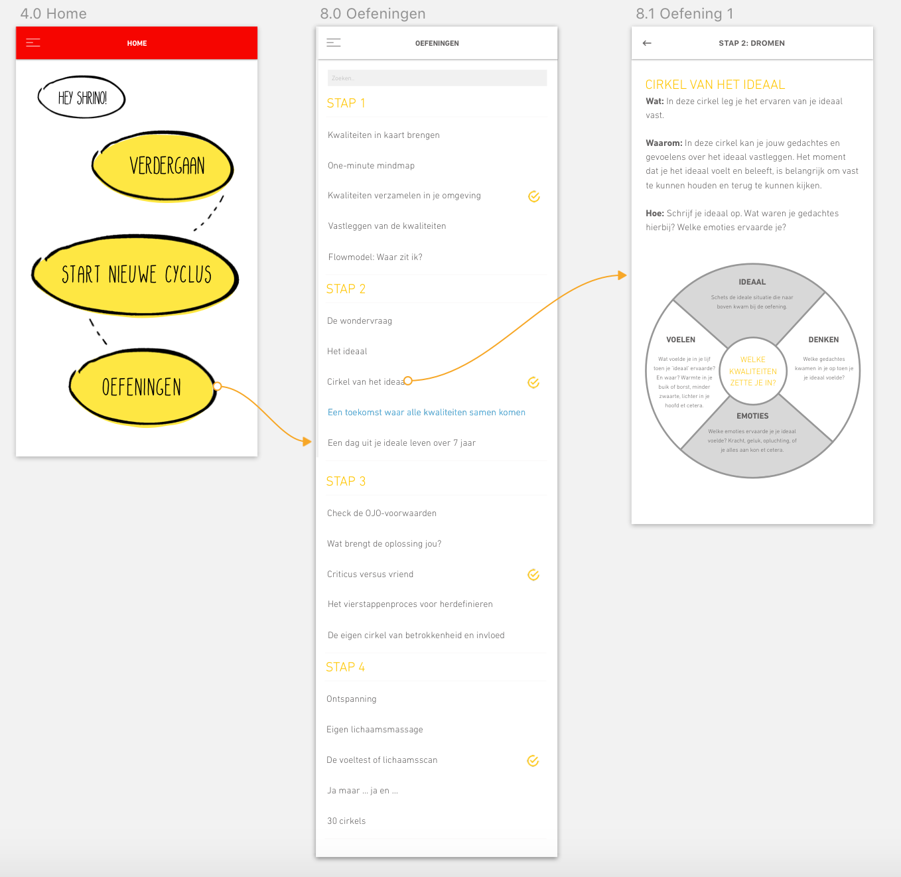
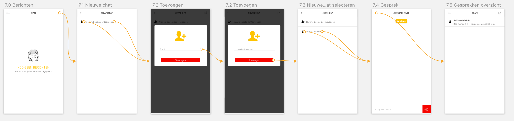
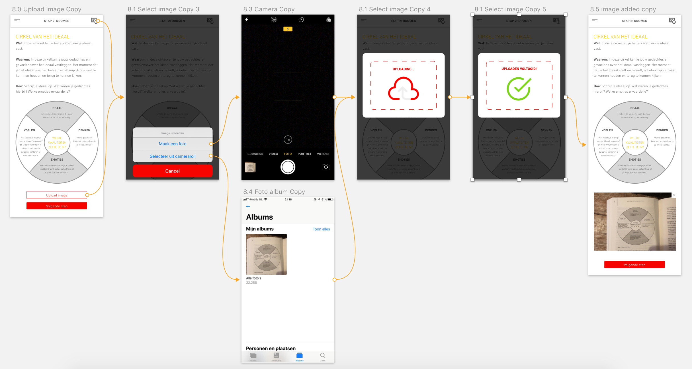
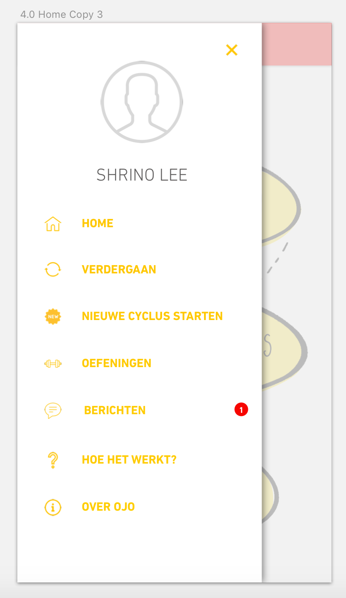

# 4.4 Prototype 0.8

Vanuit [de testresultaten van prototype 0.5](../4.3-prototype-0.5/4.3.1-test-+-resultaten.md) heb ik opnieuw geïtereerd om tot mijn volgende prototype te komen. Ik heb de gekregen feedback verwerkt en vormgegeven in de nieuwe versie van mijn prototype. De toelichting op het nieuwe prototype is volledig terug te vinden op deze pagina. 

### 1.0 Inloggen + 3.0 Registeren

> Om het zo makkelijk mogelijk te maken voor de gebruiker heeft hij bij het inloggen alleen een e-mailadres en wachtwoord nodig. Bij het registreren wordt deze tevens ook gevraagd. Daarnaast moet de gebruiker bij het registreren zijn volledige naam opgeven zodat hij/zij in de app persoonlijk kan worden aangesproken. Dit zorgt ervoor dat de gebruiker het gevoel krijgt echt een connectie met de app te hebben.

Op de toevoeging van de vormgeving na geen grote veranderingen ten opzichte van het vorige prototype.

### 2.0 Over OJO

> Wanneer de gebruiker eerst meer informatie wil hebben over Ontwerp je Ontwikkeling kan hij/zij ervoor kiezen om meer informatie te bekijken. Hier wordt er in verschillende tabbladen uitleg gegeven over het boek, de methode en over de schrijfster van het boek.

Deze informatie is nu ook terug te vinden via het menu.

### 4.0 Home

> Als de gebruiker de introductie heeft doorlopen komt de gebruiker terecht op de Homepagina terecht. Op de Homepagina krijgt de gebruiker de keuze uit 3 opties. De opties zijn: 'Verdergaan' 'Aan de slag' en 'Oefeningen'.

De grote verandering is het toevoegen van het hamburgermenu. Om ten alle tijden je weg te kunnen vinden in de app zijn alle mogelijkheden in de app toegevoegd in het menu.

### 5.0 'Hoe het werkt?'

> **4.0 Uitleg**  
> Bij de eerste keer inloggen krijgt de gebruiker direct een introductie van de methode te zien. Hierin komt naar voren wat er van de gebruiker verwacht wordt en wat het doel van de oefeningen is. Wanneer de gebruiker voor de 2e keer inlogt wordt deze introductie niet meer getoond..

In plaats van Introductie heet dit gedeelte van de app nu: "Hoe het werkt?". Ook is het moment van tonen veranderd. Elke keer wanneer de gebruiker start met een nieuwe cyclus krijgt de gebruiker dit te zien. Als hij het wilt overslaan kan er ten alle tijden op de Skip-button worden gedrukt.

Ook is "hoe het werkt?" terug te vinden in het menu.

### **6.0 Verdergaan**

> Hier krijgt de gebruiker de keuze om verder te gaan met een nog niet afgeronde cyclus. Hier wordt een lijst getoond met actieve cyclussen. Na gekozen te hebben welke cyclus hij wilt hervatten gaat hij verder met de oefening waar hij is gestopt.

Op de vormgeving na heeft dit gedeelte geen grote veranderingen.

### **7.0 Nieuwe cyclus starten**

> **5.3 Aan de slag**  
> Als de gebruiker aan een nieuwe cyclus wil beginnen, moet hij/zij eerst het probleem/uitdaging invoeren. Op basis van deze beschrijving zal de app een speciaal samengestelde cyclus ontwerpen met oefeningen die exact aansluiten op het probleem/uitdaging van de gebruiker.
>
> Na het beschrijven van het probleem/uitdaging zal de gebruiker elke stap doorlopen en de daarbij behorende oefeningen uitvoeren.

Zoals ik hierboven al heb beschreven wordt "Hoe het werkt?" elke keer weergegeven bij het starten van een nieuwe cyclus. Daarnaast heet het nu 'start nieuwe cyclus' in plaats van aan de slag.

### 8.0 Oefeningen

> **10.0 Oefeningen**  
> Hier kan de gebruiker zelfstandig op zoek gaan naar oefeningen. Met behulp van een zoekfunctie kan de gebruiker makkelijk oefeningen opzoeken. Ook kan de gebruiker opgezochte oefeningen toevoegen aan een zelf samengestelde cyclus.

Wanneer de gebruiker op zoek gaat naar oefeningen kan hij zien welke hij al eens eerder heeft gemaakt. Dit is de enige extra toevoeging ten opzichte van het vorige prototype. 

### **9.0 Chatten**

De grootste verandering ten opzichte van het vorige prototype is de chatfunctie. Wanneer de gebruiker het nodig vindt om zijn begeleider een vraag te stellen over een opdracht of voor het inplannen van de laatste reflectie stap kan hij gebruik maken van de chatfunctie. Op deze manier kan er snel gecommuniceerd worden.

Door middel van een e-mail adres kan een begeleider toegevoegd worden.

### **10.0 Afbeelding toevoegen**

> Wat ook nieuw is in het prototype is het toevoegen van afbeeldingen aan opdrachten. Wanneer de gebruiker het prettiger vindt op sommige opdrachten op papier te maken, moet hij de mogelijkheid krijgen om toch zijn opdracht toe te voegen.  Door middel van het toevoegen van een afbeelding kan dit nu gedaan worden.

Uit de test van [Prototype 0.5](../4.3-prototype-0.5/4.3.1-test-+-resultaten.md) is gebleken dat niet elk testpersoon het icoontje rechts boven even duidelijk vindt. Zij gaven aan dat zij deze feature graag nog een keer terug wilde zien op de pagina in de form van een button.

Daarnaast wachtte 1 van de testpersonen op een bevestiging van het uploaden van de afbeelding. Hij verwachte namelijk op de bevestiging voordat hij verder kon gaan. Daarom is er een bevestiging toegevoegd die wordt getoond zodra het uploaden voltooid is.

### 9.0 Menu

> Om ervoor te zorgen dat de gebruiker ten alle tijden zijn weg kan vinden in de app is er een menu toegevoegd. Via dit menu zijn: Verdergaan, Nieuwe cyclus starten, Oefeningen, Berichten, Hoe het werkt? en over OJO te bereiken.

Uit de test van [Prototype 0.5](../4.3-prototype-0.5/4.3.1-test-+-resultaten.md) is gebleken dat elk het niet lukte om terug te keren naar de homepagina. Dit had namelijk een opvallende reden, namelijk: de home button ontbrak in het menu. Deze is voor Prototype 0.9 toegevoegd. Daarnaast is er ook een kruisje toegevoegd zodat de gebruiker het menu kan afsluiten.

### **Reflecteren**

> **9.0 Stap 7: Reflecteren**  
> Zodra de gebruiker is aangekomen bij de laatste stap van de cyclus, \(Stap 7: reflecteren\), kan er een gesprek ingepland worden met de begeleider. Door aan te geven welke dagen de gebruiker beschikbaar is wordt er een bericht gestuurd naar de begeleider zodat hij/zij hier rekening mee kan houden.

De functie met het aangeven van de dagen is op advies van de opdrachtgever niet meer terug te vinden in de app. Nu kan er door middel van de chatfunctie een afspraak worden gemaakt om de laatste stap te doorlopen.

