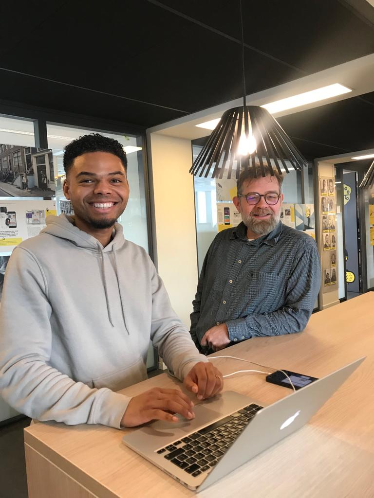

# 4.5.1 Expert review

## Inleiding

Om van een expert uit het vakgebied feedback te krijgen op [Prototype 0.9](./), heb ik een Expert Review ingepland met Jos Kok. Een expert review is een manier om input te krijgen van een ‘expert’ over het functioneren van het product. Jos Kok is docent op de opleiding Communication en Multimedia Design en gespecialiseerd in User Centred Design.   
  
De uitwerking van het gesprek en de belangrijkste aanpassingen voor mijn nieuwe prototype zijn terug te vinden op deze pagina. 

## Voorbereiding Expert Review

Het doel van het gesprek met Jos Kok was om kritische feedback te ontvangen op mijn prototype. De feedback die ik ontvangen heb zal worden meegenomen in het ontwerp van [Prototype 1.0. ](../../untitled/3.5-visueel-onderzoek/3.5.1-design-patterns.md)  
  
Om feedback te krijgen op het prototype heb ik verschillende Job Stories uitgewerkt die ik Jos Kok zal laten uitvoeren. Zo kan ik er achter komen of de functionaliteiten van het eindproduct goed uit te voeren zijn. Daarnaast zal ik na het uitvoeren van de Job Stories om tips en feedback vragen en zal ik vragen of Jos continu hardop wil denken.

## Uitwerking Expert Review

1. **Je wil meer informatie weten over de methode en de schrijfster, maar je wilt geen account maken.** Klikt netjes eerst op informatie, vervolgens of over mij. Gaat dus goed. Opmerking: "Niet te veel tekst, dat is wel leuk!" Gaat daarna naar de info over de methode. Opmerking: "Ik zou wel willen inzoomen op de plaatjes, ik ben een oude man he! ;\)"  ****
2. **Je vindt Ontwerp je Ontwikkeling interessant en wilt graag een account aanmaken.** Opmerking: "Lijkt me logisch, ik moet me eerst registereren." Klikt op 'Registreren'. "Dit is ook duidelijk, ik moet hier alle info invullen en ik kan een foto uploaden. Kijk eens aan, netjes hoor!" "Ik snap hem, heel duidelijk" Hij logt vervolgens netjes in. ****
3. **Je wil een nieuwe cyclus starten, maar je weet al hoe het werkt. Daarna ben je benieuwd welke oefeningen stap 1 van jouw nieuwe cyclus bevat.** Opmerking: "Oke ik weet al hoe het werkt dus ik wil alleen weten welke oefeningen erin zitten." Gaat goed. Klikt overal netjes doorheen. "Kijk eens, gevonden! Netjes". "Wat mooi zeg!" Job story wordt probleemloos uitgevoerd.  ****
4. **Je bent tussentijds gestopt en wil graag verder gaan met de cyclus ‘ONZEKERHEID BELEMMERT MIJ IN MIJN FUNCTIONEREN’** Opmerking: "Oke eerst naar Home denk ik". Gaat goed. Klikt vervolgens netjes op 'Cyclus hervatten'. Kijkt welke cyclus hij wil hervatten en kiest de juiste cyclus uit. "Kijk eens, daar is hij, wauw echt leuk!" "Oke met deze oefening was ik bezig." De Job Story is goed voltooid. ****
5. **Je wil graag een afbeelding toevoegen aan één van de oefeningen.**  
   Gaat goed. Opmerking: "Dit is goed." "Hij is aan het uploaden, nu zit hij erin. En nu kan ik naar de volgende stap" De Job Story is goed voltooid.

6. **Je wil je begeleider graag toevoegen zodat je hem een bericht kunt sturen.** Opmerking: "Hmmm.. hoe ga ik dat doen?" Klikt een paar keer niet goed. "Begeleider toevoegen is ingewikkeld. Ik ga het even op 'Hoe het werkt' klikken om op te zoeken hoe dat moet. Ah gevonden, misschien via 'Berichten'. Gevonden!"  "Het toevoegen van een begeleider is wel heel ver weg. Je job story had je beter kunnen veranderen naar: Je wil een bericht sturen naar je begeleider, voeg hem toe. Zo zorg je ervoor dat de gebruiker eerst gaat kijken bij 'Berichten'. Zo lijkt het namelijk wat onlogisch terwijl het in de app wel duidelijk is."   
7. **Je bent benieuwd wat je moet doen bij de oefening ‘de cirkel van het ideaal’.** Gaat netjes naar de juiste oefening toe. Opmerking: "Hoe zie ik welke stap ik al heb gedaan? Misschien kan je de stappen die nog niet beschikbaar zijn wat meer vervagen." Leest vervolgens de uitleg van de oefening. "Ik denk dat dit alle informatie is die ik over de oefening kan vinden." Dit klopt.  ****
8. **Je bent vergeten hoe sommige dingen werken.** Opmerking: "Dan is de meest logische stap om op het vraagtekentje te klikken \('Hoe het werkt'\), en dit even te bekijken." Gaat goed. "Dit ziet er erg logisch en duidelijk uit!"  
9. **Je wil terug naar de homepagina** Gaat goed. Opmerking: "Ook logisch, dan ga ik gewoon via het menu naar de Homepagina."  Opmerking: "Hamburger-menu is altijd goed, netjes!"    **Oke, nu heeft u alle Job Stories gehad. Heeft u nog feedback voor mij?** Ja, erg duidelijk allemaal. Alleen hier \(Pagina 'Berichten'\) noem je het 'Berichten', terwijl het het hier 'Chats' noemt. Dat is eigenlijk hetzelfde toch? Je kan dit beter dezelfde naam geven.   "Maar leuk hoor! Ziet er goed uit! Ik vind het vrij intuïtief allemaal, je gaat overal lekker makkelijk doorheen. Super goed! Ik vind de kleuren ook wel leuk, lekker fris. Mooi vormgegeven en heel herkenbaar."  "Ik heb eigenlijk verder niet zoveel erop aan te merken verder. Heel leuk!" 

## Conclusie

Jos was gelukkig super positief over mijn eindproduct. Hij is netjes door alle Job Stories heengegaan. Hij had hier en daar gelukkig ook nuttige feedback voor de laatste aanpassingen voor[ Prototype 1.0.](../../5.-validatie/5.1-prototype-1.0.md)

**Belangrijkste veranderingen:**

* **De stappen die nog niet beschikbaar zijn beter vervagen, zodat het duidelijker wordt dat de gebruiker hier nog niet op kan klikken.** 
* **Keuze maken tussen de termen 'Chats' en 'Berichten', hier consistent in zijn.** 
* **Mogelijk maken om in te zoomen op de afbeeldingen.**

Verder gaf Jos aan dat hij de app erg intuïtief vindt en dat je overal lekker makkelijk doorheen gaat. Ook vond hij de vormgeving erg mooi en lekker fris. Dit vond ik natuurlijk leuk om te horen, erg positief commentaar! 

