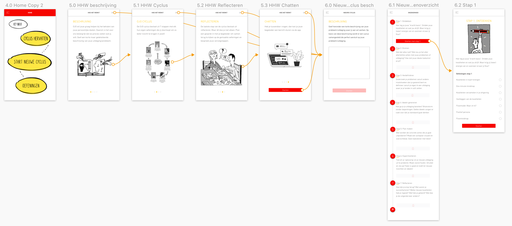
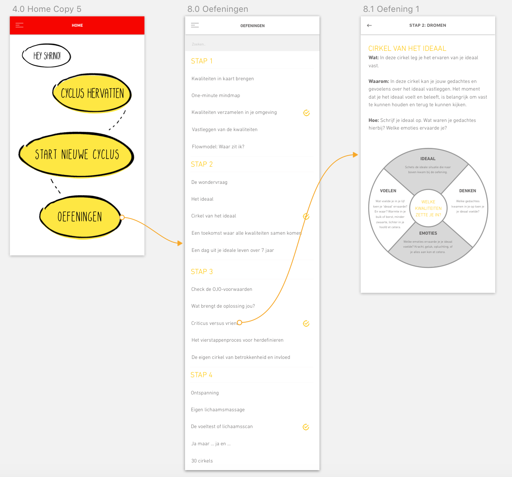
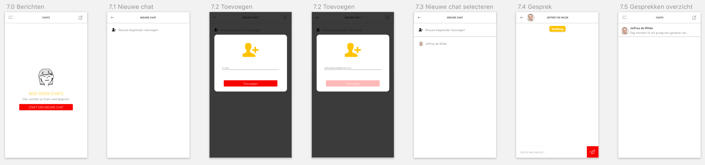
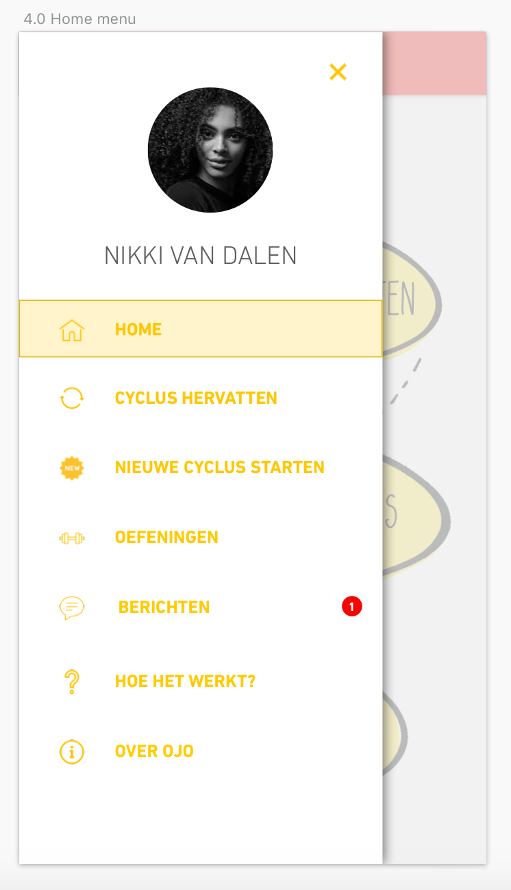

# 5.1 Prototype 1.0

Vanuit het [Expert review](../4.-ontwerpfase/4.5-prototype-0.9/4.5.1-expert-review.md) met [Prototype 0.9](../4.-ontwerpfase/4.5-prototype-0.9/) heb ik de laatste aanpassingen gedaan om uiteindelijk bij mijn Prototype 1.0 te komen. Ik heb de feedback die ik vanuit het Expert review ontvangen heb, verwerkt in mijn nieuwe, laatste prototype. De volledige toelichting op het nieuwe prototype is terug te vinden op deze pagina.

### 1.0 Inloggen + 3.0 Registeren 

Zodra de gebruiker de app opent komt krijgt hij hier eerst de mogelijkheid om te kiezen tussen inloggen en registreren. Wanneer de gebruiker alleen meer informatie wil hebben over Ontwerp je Ontwikkeling kan hij op de 'i' rechtsboven klikken.

Bij het registreren krijgt de gebruiker de mogelijkheid om zich aan te melden met zijn voor- en achternaam, e-mail en een wachtwoord. Daarnaast krijgt hij ook de keuze om een profielfoto te uploaden. Dit is echter niet verplicht. Ten opzichte van [Prototype 0.9](../4.-ontwerpfase/4.5-prototype-0.9/) zijn hier geen aanpassingen geweest. In het Expert review is gebleken dat deze flow probleemloos te voltooïen was. 

### 2.0 Over OJO 

Op dit scherm is het mogelijk om meer informatie te bekijken over Ontwerp je Ontwikkeling. Door middel van tabs is het mogelijk om tussen de verschillende soorten informatie te swipen. Wanneer de gebruiker een afbeelding niet goed kan lezen, is het voor hem mogelijk om in te zoomen hierop, dit werd mij geadviseerd tijdens het Expert review. Ten opzichte van [Prototype 0.9](../4.-ontwerpfase/4.5-prototype-0.9/) is het inzoomen de enige verandering.

### 3.0 Homepagina 

Eenmaal in de applicatie wordt de gebruiker begroet bij zijn naam. Op dit scherm zijn er 3 opties te vinden. Hier kan de gebruiker ervoor kiezen om een cyclus te hervatten, een nieuwe cyclus te starten of om verschillende oefeningen te bekijken. Als de gebruiker nog niet eerder aan een cyclus is begonnen kan er geen cyclus worden hervat. In dat geval bevindt de Homepagina zich in een andere state \(zie afbeelding\). Ten opzichte van [Prototype 0.9](../4.-ontwerpfase/4.5-prototype-0.9/) is er binnen deze flow verder niks veranderd.

### 4.0 'Hoe het werkt?' 

Als de gebruiker ervoor kiest om een nieuwe cyclus te starten, wordt de 'Hoe het werkt?' getoond. Hierin is een uitleg te zien hoe de cyclus proces werkt en wat er van de gebruiker verwacht wordt. Als de gebruiker al eens eerder met een nieuwe cyclus is begonnen kan hij deze uitleg ten alle tijden overslaan door op de Skip-button rechtsboven te klikken. Ten opzichte van [Prototype 0.9](../4.-ontwerpfase/4.4-prototype-0.9/) is hier niks aan veranderd.

### **5.0 Cyclus hervatten** 

Als de gebruiker tussentijds is gestopt met een oefening krijgt hij de mogelijkheid om deze probleemloos te hervatten. Dit kan door op de 'Cyclus hervatten'-button op de Homepagina te klikken, of via het menu. De gebruiker ziet vervolgens in een carousel alle cyclussen waar hij ooit aan begonnen is en kan hier doorheen swipen. Hier is per cyclus tevens te zien bij welke stap en opdracht hij is gebleven. 

Als de gebruiker zijn keuze heeft gemaakt komt hij terecht om het stappenoverzicht. Hier is de voortgang van de gebruiker te zien - welke stappen hij al heeft doorlopen en wat de vervolgstappen zijn. Ten opzichte van [Prototype 0.9](../4.-ontwerpfase/4.4-prototype-0.9/) zijn de stappen die nog niet beschikbaar zijn wat transparanter gemaakt waardoor het nog duidelijker moet zijn voor de gebruiker dat hij deze stappen nog niet kan doorlopen.

Zodra de gebruiker een stap aanklikt komt hij terecht op de pagina waarop er wordt uitgelegd wat de stap precies inhoudt en welke oefeningen de stap bevat. Aan de vinkjes kan de gebruiker zien welke oefeningen hij al heeft afgerond. Wanneer de gebruiker op de Hervatten-button klikt, gaat de gebruiker door met de oefening.

### **6.0 Nieuwe cyclus starten** 

Zodra de gebruiker er voor kiest om een nieuwe cyclus te starten zal er eerst uitleg worden gegeven over de werking van de cyclus \(zie 4.0 'Hoe het werkt?'\). Vervolgens krijgt de gebruiker de mogelijkheid om het probleem of de uitdaging te omschrijven waar hij aan wil gaan werken. Met behulp van kernwoorden die aan elke oefening gekoppeld zijn, kan de app een op maat samengestelde cyclus genereren die perfect aansluit op de wensen van de gebruiker. Ook hierna komt de gebruiker terecht op het stappenoverzicht. Ten opzichte van [Prototype 0.9](../4.-ontwerpfase/4.4-prototype-0.9/) is hier niks aan veranderd.

### 7.0 Oefeningen 

Als de gebruiker een bepaalde oefening wil bekijken of er meer over wil weten kan hij via de Homepagina 'Oefeningen' aanklikken. De pagina is tevens ook te bereiken via het menu. In dit gedeelte van de app zijn alle OJO oefeningen terug te vinden. Met behulp van een zoekfunctie kan de gebruiker ook oefeningen opzoeken.  Ten opzichte van [Prototype 0.9](../4.-ontwerpfase/4.4-prototype-0.9/) is hier niks aan veranderd.

### **8.0 Berichten** 

Als de gebruiker vragen heeft over een bepaalde oefening of graag een gesprek met zijn begeleider in wil plannen, kan hij gebruik maken van de berichten-functie. Hij kan zijn begeleider toevoegen doormiddel van een e-mailadres. Vervolgens komt de begeleider direct in de contactenlijst te staan. Hierna kunnen zij een gesprek beginnen. 

Na het [Expert review](../4.-ontwerpfase/4.5-prototype-0.9/4.5.1-expert-review.md) kreeg ik het advies om consistent om te gaan met de benaming van deze functie. Er werd gebruik gemaakt van de termen 'chatten' en van 'berichten'. Om consistent te blijven en geen verwarring te creëren bij de gebruiker gaf de expert aan om te kiezen voor de term 'berichten'. Dit is de enige verandering ten opzichte van [Prototype 0.9](../4.-ontwerpfase/4.4-prototype-0.9/).

### **9.0 Afbeelding toevoegen** 

Bij het maken van de oefeningen krijgt de gebruiker de mogelijkheid om afbeeldingen toe te voegen aan een oefening. Het komt namelijk wel eens voor dat de gebruiker een oefening liever op papier maakt. In dat geval moet het dan alsnog mogelijk zijn om de oefeningen in de OJO app te krijgen. Tijdens en na het uploaden wordt de gebruiker voorzien van feedback zodat hij weet of het is gelukt om de afbeelding toe te voegen. De gebruiker heeft vervolgens nog de mogelijkheid om de foto via het kruisje rechtsboven te verwijderen en een nieuwe foto te uploaden. Zo zorg je ervoor dat de gebruiker mogelijke fouten zelf kan herstellen. Ten opzichte van [Prototype 0.9](../4.-ontwerpfase/4.4-prototype-0.9/) is hier niks aan veranderd.

### 10.0 Menu 

Via het hamburgermenu zijn alle functies van de app te bereiken. Ten opzichte van [Prototype 0.9](../4.-ontwerpfase/4.4-prototype-0.9/) is hier niks aan veranderd.

### 11. Push-meldingen 

De OJO app maakt gebruik van twee soorten push-meldingen. De eerste push-melding is om de gebruiker te herinneren om zijn oefeningen te maken. Zo zorg je ervoor gezorgd dat de gebruiker dit niet vergeet. Als de gebruiker de app langer dan 3 dagen niet geopend heeft, wordt het bericht verstuurd. De tweede push-melding is voor als de gebruiker een bericht ontvangt van zijn begeleider. Zo kan er snel gecommuniceerd worden tussen de gebruiker en zijn begeleider.

