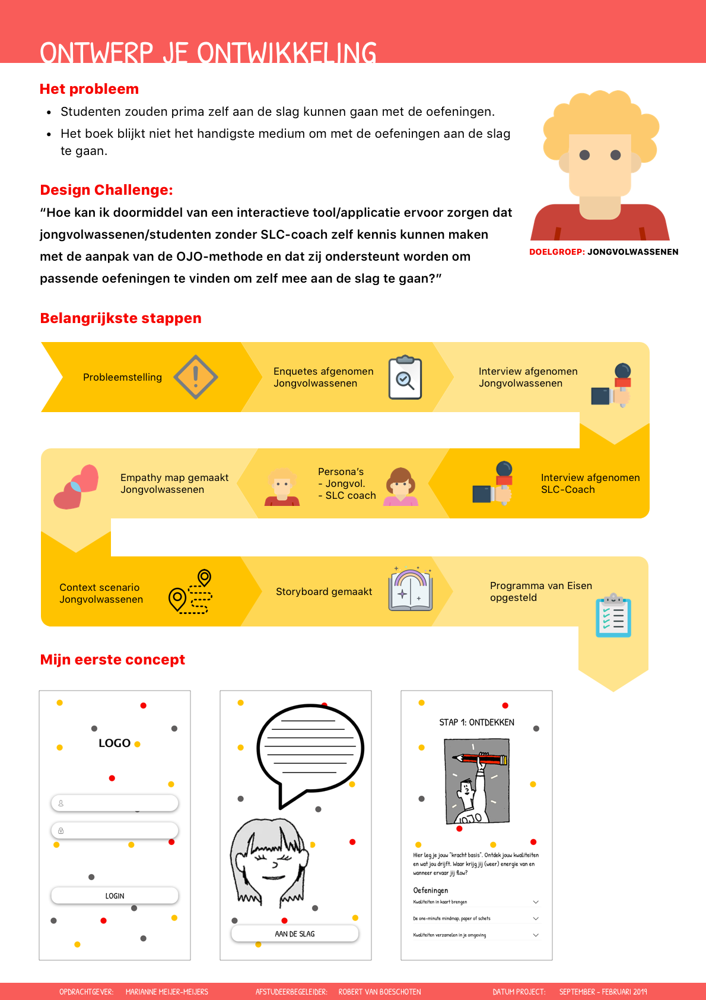
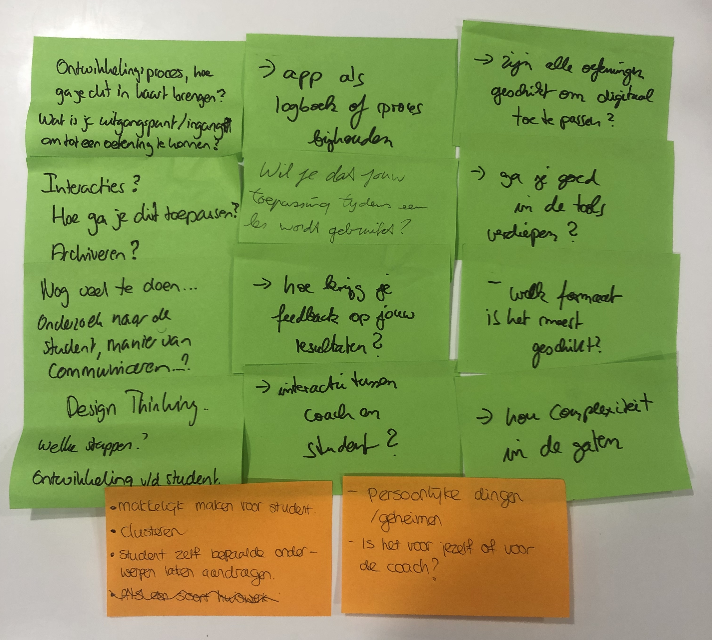

# 3.3 Feedback Frenzy

## Inleiding

Op vrijdag 23 november heb ik mijn belangrijkste stappen en mijn eerste concept gepresenteerd tijdens de Feedback Frenzy. Na mijn presentatie heb ik vragen/feedback gekregen die ik goed kan gebruiken om mijn project te verbeteren.

## **De poster**

## **Feedback**

* “**Zijn alle oefeningen geschikt om digitaal toe te passen?”** In principe zijn alle oefeningen goed te doen op tablet en mobiel. Bij sommige oefeningen moet er namelijk getekend worden. Dit is niet goed te doen op bijvoorbeeld een laptop. Als de gebruiker het toch niet zo prettig vindt om de oefening op een digitaal device te doen kan dit ook op papier gedaan worden en de tekening vervolgens als afbeelding uploaden. 
* **“Houd de complexiteit in de gaten”** Het kan zo zijn dat ik te veel functies uit wil werken. Dit kan ervoor zorgen dat ik tijd te kort kom om alles goed uit te werken. Ik moet er dus voor zorgen dat ik de belangrijkste elementen uitkies en deze goed ga onderzoeken en uitwerken voor mijn eindoplevering. 
* **“Welk device is het meest geschikt?”** Uit mijn onderzoek is naar voren gekomen dat 100% van de ondervraagde een smartphone tot zijn beschikking heeft en daarnaast maakt ook iedereen gebruik van een 2e device. Dit is dan een tablet of laptop. Uit mijn deskresearch heb ik kunnen concluderen dat het voor mijn project niet nodig is om te kiezen tussen mobiel en tablet. Het is van belang dat mijn eindoplossing op beide apparaten te gebruiken is.  
* **“Ga je goed in de tools verdiepen.”** Om mij meer in de oefeningen te verdiepen heb ik zelf een coaching gesprek ingepland waarin ik samen met een coach een aantal oefeningen ga maken. Ik hoop dat ik na dit gesprek een beter begrijp hoe de oefeningen werken en hoe je deze het beste kunt maken. 
* **“Hoe krijg je feedback op jouw resultaten?”** Om ervoor te zorgen dat je je zo goed mogelijk ontwikkelt met de oefeningen is het belangrijk dat de gebruiker feedback krijgt over de gemaakte opdrachten. Daarom is het belangrijk dat de coach van de gebruiker goed kan bijhouden of de oefeningen zijn gemaakt, wat er goed gaat en wat er beter kan. De coach kan dan via de applicatie feedback geven aan de gebruiker of er kan een gesprek ingepland worden. 
* **“Onderzoek doen naar de student, manier van communiceren?”** Ik ben mijn onderzoek begonnen met het[ enquêteren van studenten,](../2.-onderzoek/2.3.1-doelgroep.md) hierbij ben ik tot verschillende inzichten gekomen.  Daarnaast heb ik ook verschillende interviews afgenomen omdat ik in mijn enquête nog een aantal vragen had waar ik wat dieper op in wilde gaan. De communicatie tussen student en docent gaat momenteel veelal via de mail. 
* **“Wil je dat jouw toepassing tijdens een les wordt gebruikt?”** Eén van de problemen die mijn opdrachtgever aangaf was het feit dat coaches op dit moment door het boek moeten bladeren om goede oefeningen te vinden. Tijdens een les of een 1-op-1 coaching gesprek neemt dit teveel tijd in beslag. Mijn toepassing zou ervoor kunnen zorgen dat dit om een makkelijkere, efficiëntere manier gebeurt zodat het minder tijd kost om een geschikte oefening te vinden. Dit kan dus ook tijdens een les. 
* **“Interactie tussen coach en student?”** Het is belangrijk dat de student feedback krijgt om zich zo goed mogelijk te kunnen ontwikkelen. Door de chatfunctie die is verwerkt in de app krijgt de student de mogelijkheid om elk gewenst moment vragen te stellen aan de coach. Het belangrijkste feedback moment vindt plaats aan het eind van de cyclus. Stap 7 is reflecteren. Hierbij ga je terug kijken op de afgelopen periode samen met je coach en worden alle oefeningen besproken. Ook worden daar de vervolgstappen in besproken. 
* **Wat is je uitgangspunt/ingang om tot een oefening te komen?** Voordat de student begint aan de cyclus krijgt hij de mogelijkheid om zijn probleem of doel uit te leggen. Op basis van steekwoorden worden er oefeningen gekozen die zo goed mogelijk hierop aansluiten. Daarnaast kan een coach ook een oefening aanbevelen aan een student.

## Belangrijkste eisen:

* De gebruiker moet een afbeelding toe kunnen voegen aan een opdracht. **\(Must have\)**

