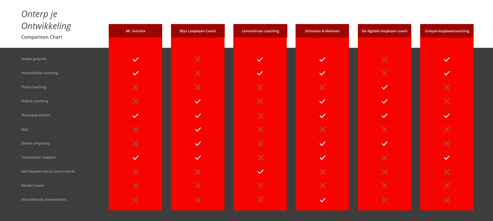

# 3.4 Concurrentie onderzoek

## Inleiding

Om inzicht te krijgen in het werk van de concurrentie heb ik een Comparison Chart opgesteld van concurrerende online tools op het gebied van Loopbaancoaching. In een Comparison Chart vergelijk je verschillende concurrenten op basis van verschillende eigenschappen. Zo wordt het duidelijk waarin jij je kan onderscheiden van de rest, maar kan je daarnaast ook inspiratie opdoen.  

De uitwerking van de Comparison Chart, de belangrijkste resultaten van het onderzoek en de eisen voor mijn [Programma van Eisen](3.7-programma-van-eisen-1.0.md) zijn op deze pagina terug te vinden. 

Tijdens het onderzoek naar loopbaancoaching kwamen er veelal dezelfde soort bedrijven naar voren. Wat opviel is dat bijna alle bedrijven een andere aanpak hebben als het gaat om loopbaancoaching. Zo doet de één het bijvoorbeeld op afstand en de ander alleen persoonlijk. Sommige hebben wel een digitale omgevingen anderen doen het met behulp van werkbladen. Uit mijn onderzoek zijn de volgende concurrenten naar voren gekomen.













## Comparison Chart

Om de verschillende bedrijven met elkaar te kunnen vergelijken, heb ik een Comparison Chart opgesteld. Voor dit overzicht heb ik gekeken naar hoe deze bedrijven het geven van loopbaancoaching aanpakken, wat zij aanbieden en op welke manier zij dit doen. Zodra ik bij een concurrent iets tegenkwam dat ik nog niet eerder had gezien, voegde ik dit toe aan de lijst. 

## Belangrijkste resultaten:

Het eerste dat mij opvalt aan de Comparison Chart is dat er nog haast geen apps zijn die loopbaancoaching aanbieden. De enige op dit moment is Mijn Loopbaan Coach. Wat nog meer opvalt is dat geen enkele concurrent coaching aanbiedt zonder daarbij persé een fysieke coach te hebben. 

Ook is er te zien dat er maar één bedrijf is die jouw de keuze geeft tussen meerdere coaches. De andere hebben veelal maar één coach waar je uit kunt kiezen.

## **Belangrijkste eisen:** 

* De gebruiker moet zelf kunnen bepalen wie zijn coach wordt. **\(should have\)**
* De gebruiker moet zonder coach de opdrachten kunnen uitvoeren.**\(Must have\)**

**​**

