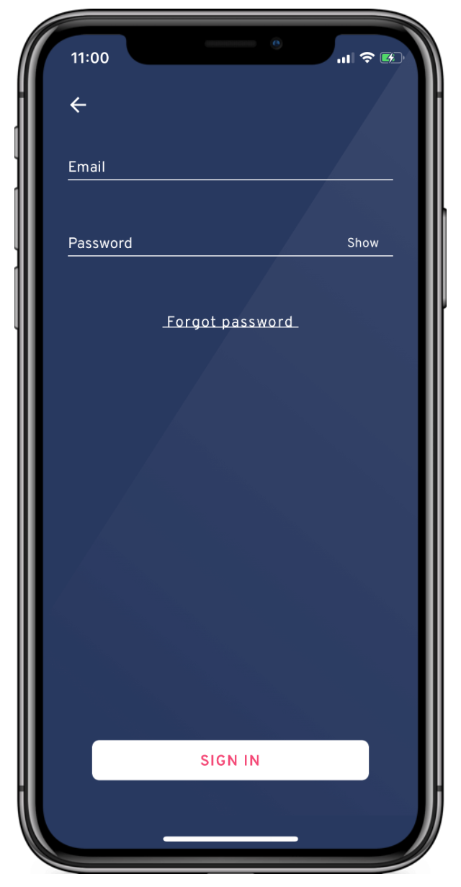
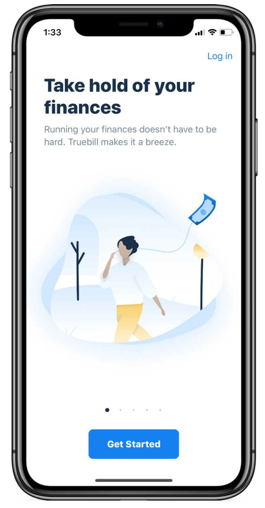
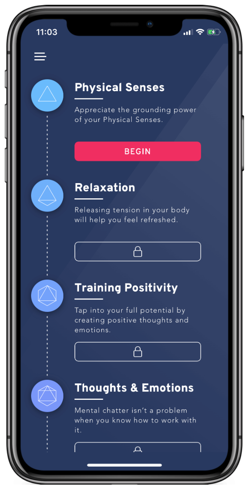
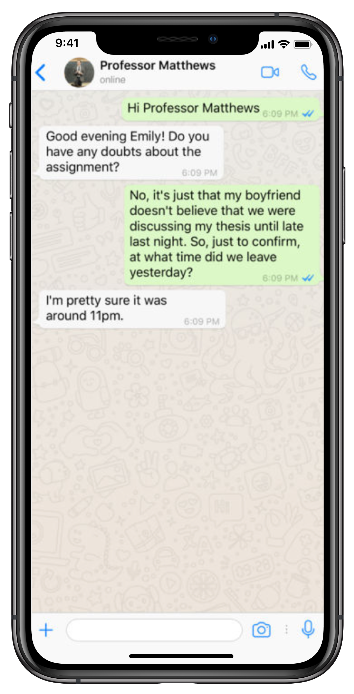
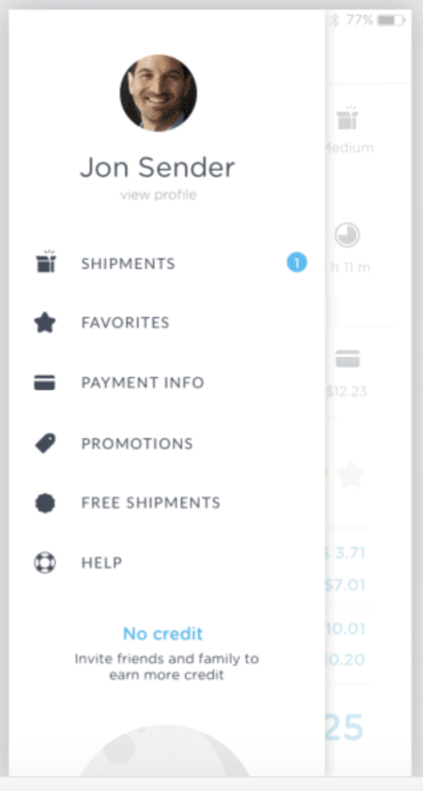

# 3.5.1 Design patterns

Om mijn eindproduct zo goed mogelijk uit te werken ben ik op zoek gegaan naar design patterns die ik toe zou kunnen passen in mijn applicatie. Bij elk pattern geef ik aan waarom ik deze interessant en bruikbaar vind voor mijn applicatie.

**Pattern 1: Login - Brightmind app**

De manier waarop de app van Brightmind het inlogscherm weergeeft vind ik erg clean en duidelijk. Ook de mogelijkheid dat je je wachtwoord kunt tonen vind ik handig. Het enige dat nog ontbreekt is een button om te registreren, maar deze zou eventueel toegevoegd kunnen worden onder de 'sign in' button.

**Pattern 2: Tabs - Robinhood app**

Deze manier van navigeren tussen verschillende tabladen vind ik handig om verschillende soorten informatie weer te geven. De gebruiker kan ook snel schakelen tussen de verschillende tabbladen.

**Pattern 3: Walktrough - Truebill app**

De combinatie van de uitleg en afbeelding vind ik erg interessant voor mijn applicatie. Zo voorkom je dat de gebruiker wordt afgeschrikt door een lap tekst en en kan de afbeelding voor nog meer duidelijkheid over de uitleg zorgen.

**Pattern 4: Process - Brightmind**

De manier waarop het proces wordt weergegeven in de Brightmind app vind ik zeer overzichtelijk. De gebruiker kan precies zien bij welke stap hij of zij zich bevindt en wat er nog komen gaat. Dankzij het slotje is het duidelijk dat sommige stappen nog niet beschikbaar zijn.

**Pattern 5: Berichten - Whatsapp**

De manier waarop Whatsapp zijn berichten weergeeft is heel duidelijk en herkenbaar voor veel gebruikers. In een artikel op Androidworld.nl wordt er geschreven dat Whatsapp ruim 1,5 miljard maandelijkse actieve gebruikers heeft \(Holdijk, 2018\). Veel gebruikers zullen dit design pattern dus herkennen en er moeiteloos mee om kunnen gaan.

**Pattern 6: Hamburger menu**

Dit design pattern heeft voor mijn gevoel alles wat ik nodig heb ik een mobile menu. Door middel van de afbeelding en de naam weet de gebruiker welk account is ingelogd. Daarnaast bevatten alle menu items icons om de menu-items visueel te verduidelijken. 

**Pattern 7: Carousel**

Dit carousel lijkt mij handig om verschillende cyclussen in weer te geven. Het is een handig pattern omdat de gebruiker door de verschillende items heen kan swipen Doordat je een deel van het volgende item ziet, weet je dat er meer items zijn.

