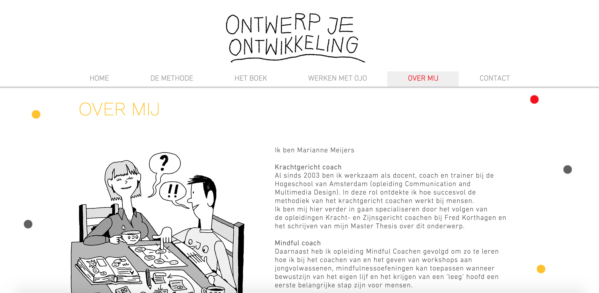
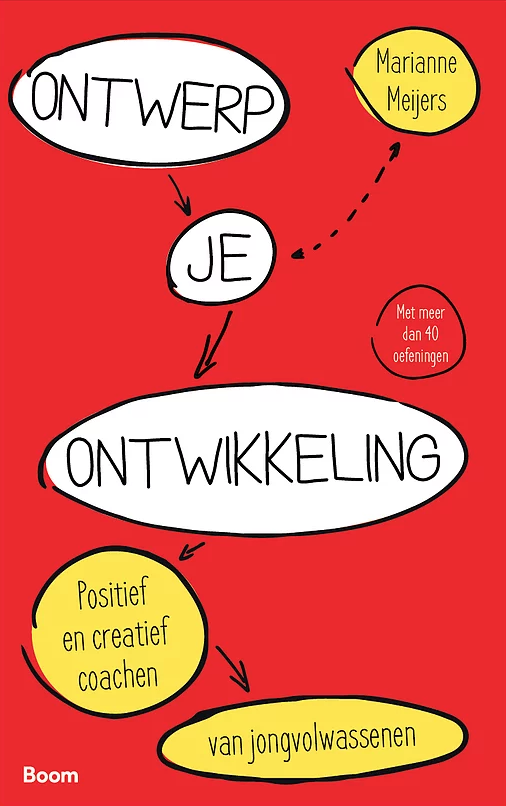

# 3.5 Visueel onderzoek

## **Huisstijl Ontwerp je Ontwikkeling**

De vormgeving van mijn oplossing moet aansluiten bij de look and feel van Ontwerp je Ontwikkeling. Het boek en de website zien er als volgt uit:

De hoofdkleur van het boek is rood. Daarnaast wordt er ook gebruik gemaakt van de kleuren geel en wit. Op de website daarentegen komen deze kleuren een stuk minder naar voren. In mijn applicatie zal ik het ontwerp wat meer afstemmen op de website. Ik zal dus wit gebruiken als mijn hoofdkleur en rood en geel als de steunkleuren.

Qua lettertype wordt er op de website DIN Next gebruikt. Ik heb ervoor gekozen om dit lettertype ook door te voeren in mijn applicatie. Door gebruik te maken van dezelfde kleuren en hetzelfde lettertype wordt de kans vergroot dat de gebruiker gelijkenis voelt tussen het OJO boek en de OJO app. 

## Styletile

## **Tone of voice**

De tone of voice van de oplossing zal als doel hebben om de gebruiker te motiveren. Uit de[ Literature study ](../../2.-onderzoek/2.9-literature-study.md)is namelijk gebleken dat er in het onderwijs altijd sprake is van verschil in macht tussen docent en student. Ik wil in mijn eindproduct dat de gebruiker zich gelijkwaardig voelt. Daarnaast zal de gebruiker continu positief benaderd worden, feedback zal continu motiverend zijn.  

## **Waarom geen rood als primaire kleur?**

Ondanks dat de kaft van het boek wel rood heeft als hoofdkleur, zal ik dit niet meenemen in mijn eigen ontwerp. In het artikel \("De betekenis van kleuren", 2015\) wordt het volgende gezegd over de kleur rood: _"De biologische effecten van rood zijn stimulerend en activerend. De kleur verhoogt de hartslag en ademhaling en wekt eetlust op. Rood is een warme kleur die aandacht trekt en geassocieerd wordt met het lichaam. De kleur van bloed is de kleur van leven, vitaliteit, energie, kracht en passie. Positieve associaties met rood zijn er ook volop op het gebied van liefde, passie en romantiek. Denk maar aan verleiding, sensualiteit, hartstocht en opwinding. Negatieve associaties met rood zijn opdringen, agressie, macht, pijn en gevaar._

_Rood heeft letterlijk stopkracht, denk maar eens aan verkeersborden. Met het dragen van rode kleding geef je aan dat je lef hebt en dat je bereid bent je eigen spoor te trekken. In een overwegend rode kamer wordt je iets actiever."_

Juist dankzij de negatieve associaties met rood wil ik dat de kleur rood niet te prominent naar voren komt in de applicatie en zal de kleur dienen als steunkleur. Denk hierbij aan buttons, hovers of titles.

## **Belangrijkste eisen:**

* De vormgeving van het eindproduct moet aansluiten op de huisstijl van OJO. **\(Must have\)**
* De vormgeving van het eindproduct moet zich houden aan de opgestelde Styletile. **\(Must have\)**
* De kleur rood mag niet te prominent naar voren komen in de vormgeving van het eindproduct. **\(Must have\)**

